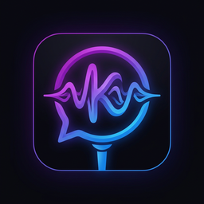

<div align="center">
  
  <h1>Koe</h1>
  <p><strong>Lightning-Fast, Privacy-Focused Voice Dictation for Windows</strong></p>
  
</div>

<br />

Koe (Japanese for "Voice") is a sleek, modern desktop application that brings lightning-fast voice dictation to any app on your PC. Built with Electron, React, and the Groq API, Koe runs quietly in the background and listens only when you tell it to.

## ✨ Features

- **Global Hotkey:** Press `Ctrl + Shift + O` (or `Cmd + Shift + O`) anywhere to start dictating.
- **Offline VAD:** Voice Activity Detection runs 100% locally on your machine using ONNX WebAssembly. Audio is only sent when speech is actually detected.
- **Instant Transcription:** Powered by the ultra-fast Whisper model via Groq API.
- **Auto-Type:** Your transcribed text is automatically typed into whichever text field or application you currently have focused.
- **Minimalist "Pill" UI:** A beautiful, non-obtrusive floating interface gives you real-time visual feedback of your recording status.

## 🚀 Quick Start

1. Download the latest `.exe` from the [Releases](https://github.com/JStaRFilms/Koe/releases) page.
2. Install and launch the application. It will run in your system tray.
3. Right-click the Koe tray icon and select **Settings**.
4. Enter your [Groq API Key](https://console.groq.com/keys) and click **Save**.
5. Click on any text input across your OS and press `Ctrl + Shift + O`. Start talking!

## 🛠️ Development

Designed using the App Router philosophy on the frontend and an event-driven IPC bridge on the backend.

### Setup
```bash
# Install dependencies
pnpm install

# Run in development mode (with hot-reload)
pnpm dev
```

### Build for Production
```bash
# Package the application for Windows
pnpm build
```

This will output the final installer into the `release/` directory.

## 💻 Tech Stack
- **Framework:** Electron, React, Vite
- **Voice Engine:** `@ricky0123/vad-web` + `onnxruntime-web`
- **Transcription:** Groq Cloud API (Whisper)
- **Styling:** Vanilla CSS with custom design tokens

## 📄 License
Copyright © 2026 Social Studios / J StaR Films Studios
