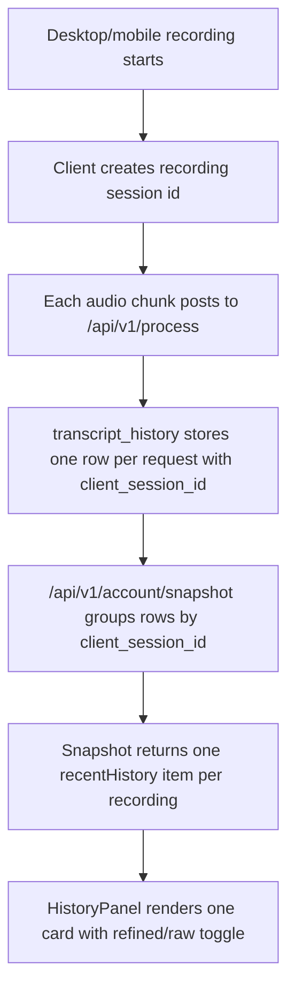

# Account History Session Grouping

## Goal

Show account history as complete recording sessions instead of one card per backend transcription segment.

When desktop or mobile splits one recording into multiple processing requests, the signed-in `/app` history should render one readable entry with concatenated text. If refined text is available, the entry should let the user toggle between refined and raw text, matching the desktop/mobile history behavior.

## Context

- `docs/Project_Requirements.md` defines history as reusable past transcriptions, not internal chunk logs.
- `docs/features/WebAppRecorderFeedbackMobileTabs.md` makes the web app history a first-class mobile tab and desktop panel, so repeated segment cards are highly visible.
- Existing account processing records every request in `transcript_history`.
- Desktop already sends `clientSessionId` for chunked account processing through `src/main/services/account-processing.js`.
- Mobile currently sends chunk requests without `clientSessionId`, so future mobile grouping needs a small request-shape update.
- Web browser recording currently sends one request per browser recording and already attaches a unique `clientSessionId`.

## Components

### Client

- `koe-website/components/web-app/HistoryPanel.tsx`
  - Render one card per grouped history entry.
  - Add a compact raw/refined segmented toggle when both forms exist and differ.
  - Copy the currently selected text or the best available text.
  - Show light session metadata such as duration/request count only when it helps explain grouped entries.

- `koe-website/components/web-app/types.ts`
  - Extend `recentHistory` entries with optional grouping metadata:
    - `requestIds`
    - `clientSessionId`
    - `segmentCount`
    - `provider`
    - `model`

- `apps/mobile/src/api/account-client.ts`
  - Accept and forward `clientSessionId` in `processAccountAudio`.

- `apps/mobile/src/providers/mobile-provider.ts`
  - Pass `ProviderOptions.sessionId` through to account processing.

### Server

- `koe-website/app/api/v1/account/snapshot/route.ts`
  - Group `transcript_history` rows by `COALESCE(client_session_id, request_id::text)`.
  - Order segments by `created_at` within the group.
  - Concatenate `raw_text` and `refined_text` with clean spacing.
  - Return one recent history item per session group, ordered by the latest segment timestamp.

- `koe-website/lib/server/usage.ts`
  - No change required for the first pass; per-request writes should remain intact for idempotency and usage accounting.

## Data Flow



## Database Schema

No schema migration is required.

Existing `transcript_history.client_session_id` is the grouping key. Rows without a session id should fall back to their `request_id` so old one-off requests continue to render as independent entries.

Recommended response shape:

```ts
type RecentHistoryItem = {
  id: string;
  requestId: string;
  requestIds?: string[];
  clientSessionId?: string | null;
  segmentCount?: number;
  mode: "byok" | "managed";
  provider?: string;
  model: string | null;
  rawText: string;
  refinedText: string | null;
  audioSeconds: number;
  createdAt: string | null;
};
```

## Implementation Plan

1. [x] Update account snapshot reads to group rows into recording-session history entries.
2. [x] Update web app history types for grouped metadata.
3. [x] Update `HistoryPanel` to render a single grouped card with an inline raw/refined toggle.
4. [x] Update mobile account processing to forward the active recording session id for future grouped history.
5. [x] Run focused type checks.
6. [x] Update this document with final implementation notes and verification results.

## Implementation Notes

Implemented on June 7, 2026.

- `koe-website/app/api/v1/account/snapshot/route.ts` now reads recent transcript rows and groups them by `client_session_id`, falling back to `request_id` for older or one-off rows.
- Grouped history entries concatenate raw text in segment order and concatenate refined text when any segment has refined text.
- The grouped response keeps per-request metadata through `requestIds` while exposing one `id` per visible history card.
- `koe-website/components/web-app/HistoryPanel.tsx` now shows one card per grouped recording, defaults to refined text, and offers a raw/refined toggle only when the two texts differ.
- `apps/mobile/src/api/account-client.ts`, `apps/mobile/src/providers/mobile-provider.ts`, and `apps/mobile/src/hooks/use-recording-pipeline.ts` now forward the mobile recording session id as `clientSessionId`.
- `packages/koe-core/src/providers/base.ts` now includes optional `sessionId` in provider options.

Existing unrelated prompt-refinement edits were present in the worktree during implementation and were left untouched.

## Acceptance Criteria

- A 31-second desktop recording split into several backend requests appears as one `/app` history card.
- The card displays the concatenated refined transcript by default when available.
- The same card can toggle to the concatenated raw transcript when raw differs from refined.
- Copy action copies the currently selected/best available transcript, not an internal segment.
- Existing one-request web recordings continue to display as one card.
- Existing older rows without `client_session_id` remain visible.
- Managed usage and request accounting remain per request and are not collapsed.

## Regression Checks

- [x] Do not reduce quota accuracy; `usage_events` and `managed_usage_periods` stay per request.
- [x] Do not change `/api/v1/process` idempotency by `request_id`.
- [x] Do not expose raw API keys or auth tokens.
- [x] Do not require a database migration.
- [x] Mobile and desktop local history behavior should remain unchanged.
- [x] Web app history should not horizontally scroll on mobile.

## Verification

- `pnpm --filter website type-check` passed.
- `pnpm --filter @koe/core type-check` passed.
- `pnpm --filter @koe/core build` passed.
- `pnpm --filter koe-mobile type-check` passed after rebuilding `@koe/core` declarations.
- `pnpm type-check` passed.
- `pnpm --filter website lint` passed.
- `pnpm --filter website build` passed.
- Local smoke test: `GET http://localhost:3000/app/` returned 200. The signed-out account snapshot request returned 401 as expected.

## Open Questions

- Should grouped cards show `N parts` explicitly, or keep the grouping invisible unless the user expands metadata?
- Should the card timestamp use the recording start (`MIN(created_at)`) or final segment (`MAX(created_at)`)?
- Should the first implementation backfill/group old mobile rows that lack `client_session_id` by close timestamps, or only fix future mobile recordings?
