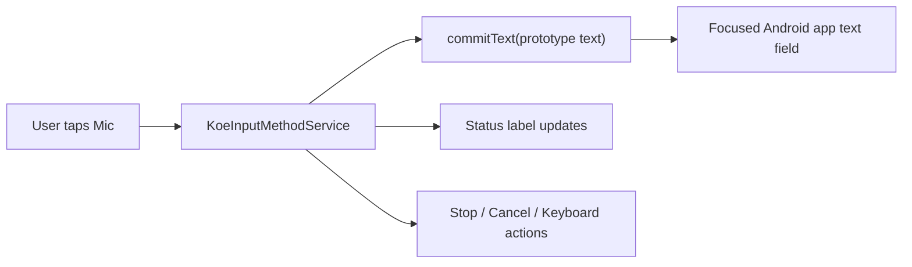

# Android IME Voice Keyboard Prototype

## Overview
This feature adds a native Android `InputMethodService` for Koe so the app can behave like a voice-first keyboard, commit dictated text into whichever field is focused, and expose a minimal control surface for start, stop, cancel, and keyboard switching.

The implementation lives inside the Expo-hosted mobile app, but the keyboard runtime is native Android code under `apps/mobile/android/`.

## Architecture
- **Android service:** `apps/mobile/android/app/src/main/java/com/jstar/koe/ime/KoeInputMethodService.kt`
- **IME layout:** `apps/mobile/android/app/src/main/res/layout/ime_voice_input_view.xml`
- **Resources:** `apps/mobile/android/app/src/main/res/values/strings.xml`
- **IME manifest:** `apps/mobile/android/app/src/main/res/xml/koe_input_method.xml`
- **Android build config:** `apps/mobile/android/build.gradle`

## Key Components

### `KoeInputMethodService`
- Inflates the IME view when the keyboard opens.
- Tracks idle and working session state.
- Commits a prototype string with `commitText(..., 1)` when the mic button is tapped.
- Stops or cancels the session without leaving the keyboard context.
- Opens the system input-method picker so the user can switch keyboards.

### `ime_voice_input_view.xml`
- Provides a compact voice-first surface instead of a full QWERTY keyboard.
- Includes a status label, a short hint, and four actions:
  - Mic
  - Stop
  - Cancel
  - Keyboard

### `build.gradle` Android staging fix
- Redirects Android build output and native CMake staging into a short temp directory.
- This avoids Windows path-length and process-launch failures caused by pnpm’s deep virtual-store layout.

## Data Flow

## Database Schema
No database is used for this prototype.

- Text is committed directly into the active editor via the Android input connection.
- No local persistence is required for the IME surface itself.

## Configuration
| Setting | Type | Default | Description |
|---------|------|---------|-------------|
| `newArchEnabled` | boolean | `false` | Keeps the Android build on the simpler legacy path for this prototype. |
| `reactNativeArchitectures` | string list | `armeabi-v7a,arm64-v8a,x86,x86_64` | Target ABIs used by the Android build. |

## Hotfix 2026-03-20: Windows Native Build Path
- **Problem:** `assembleDebug` failed on Windows while launching `prefab_command.bat` from the deep pnpm store path.
- **Solution:** Android build outputs and CMake staging were moved to a short temp directory in `apps/mobile/android/build.gradle`.
- **Result:** `:app:assembleDebug` now succeeds.
