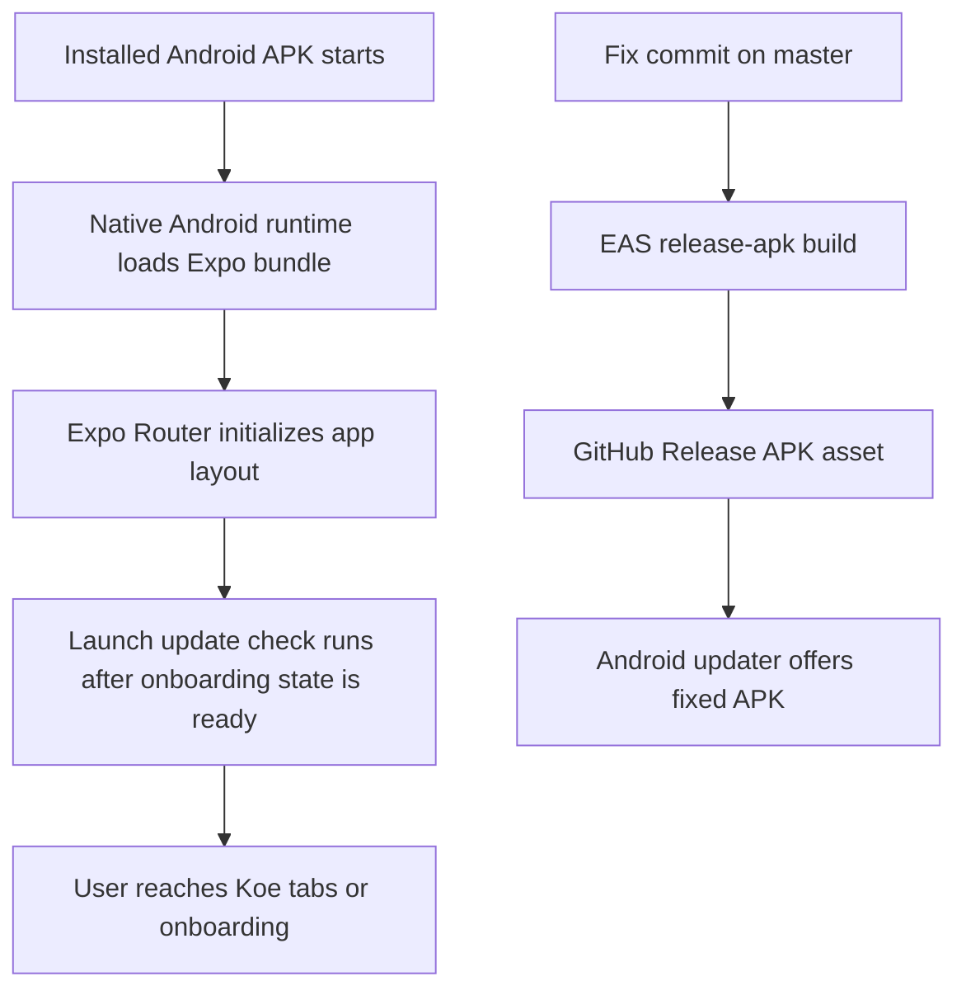

# Android Launch Crash Recovery

## Goal

Fix the Android standalone APK crash that happens after installation, then ship a new Android release from `master` so installed users can move to a working build.

## Components

### Mobile Client

- `apps/mobile/app.json`
- `apps/mobile/eas.json`
- `apps/mobile/package.json`
- `apps/mobile/app/_layout.tsx`
- `apps/mobile/src/updates/android-updates.ts`
- Android native project under `apps/mobile/android/`

### Release Tooling

- `docs/release-process.md`
- EAS `release-apk` build profile
- GitHub Release APK asset upload flow

## Data Flow

## Database Schema

No database schema changes.

## Investigation Plan

1. [x] Reproduce locally with mobile type-check and Android production bundle export.
2. [x] Inspect native Android config and Expo runtime metadata for launch-time mismatches.
3. [x] Identify the smallest root-cause fix for the startup crash.
4. [x] Update release/version metadata for a new Android build.
5. [x] Run release verification checks from `docs/release-process.md`.
6. [ ] Commit and push to `master`.
7. [ ] Run the Android release build and attach the fixed APK to GitHub Releases.

## Root Cause

`expo install --check` failed on the crashing release because the Android app had Expo SDK 54 dependency mismatches:

- `expo-intent-launcher` was `56.0.4`, but SDK 54 expects `~13.0.8`.
- `expo`, `expo-file-system`, `expo-linking`, and `expo-router` were behind SDK 54's expected patch versions.

The most serious mismatch was `expo-intent-launcher`, because Koe imports it for Android APK update installation and Android settings intents. A mismatched native Expo module can compile in cloud builds but fail when the standalone Android runtime loads native modules on launch.

## Fix

- Aligned Expo SDK 54 runtime packages with `expo install`.
- Confirmed `expo install --check` now reports dependencies are up to date.
- Bumped the combined desktop/mobile release target to `1.1.7`.
- Increased the Android fallback `versionCode` to `16`.

## Verification

- `pnpm --filter koe-mobile exec expo install --check`
- `pnpm --filter koe-mobile type-check`
- `pnpm type-check`
- `pnpm build:core`
- `pnpm build:website`
- `pnpm --filter koe-mobile exec expo config --type public`
- `pnpm --filter koe-mobile exec expo export:embed --eager --platform android --dev false`

Attempted:

- `pnpm --filter koe-mobile lint` currently cannot run because the mobile package script calls `eslint .`, but no `eslint` binary is available in the mobile package execution context.

## Notes

- User approved pushing directly to `master` and running the release process.
- Follow the release doc: commit and push before EAS so cloud builds use the fixed source.
