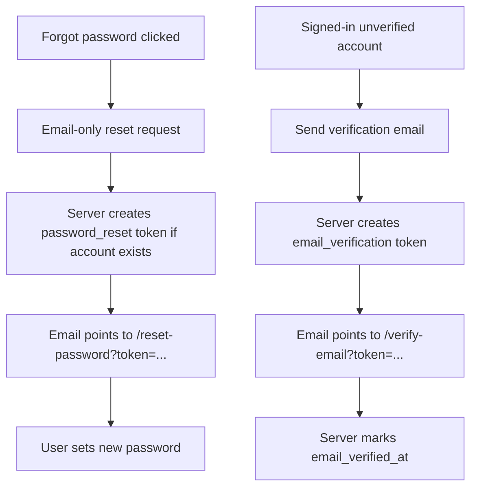

# Auth Recovery and Email Verification Flows

## Goal

Make account recovery and email verification usable from the signed-in web app and the sign-in surface on both mobile and desktop.

## Components

### Client

- `/app` signed-out auth panel:
  - add a `Forgot password?` path
  - collect email only
  - call `POST /api/v1/auth/request-password-reset`
  - show a generic success message so accounts are not enumerated
- `/app` signed-in account panel:
  - show email verification status
  - expose `Send verification email` / `Resend verification email` when unverified
  - keep the control available in the mobile `Account` tab and desktop sidebar
- `/reset-password?token=...`:
  - existing completion form remains the final password reset step
- `/verify-email?token=...`:
  - existing auto-confirm page remains the final email verification step

### Server

- Add `emailVerifiedAt` to public account responses from auth/session/snapshot helpers.
- Keep password reset and verification request endpoints server-side:
  - `POST /api/v1/auth/request-password-reset`
  - `POST /api/v1/auth/reset-password`
  - `POST /api/v1/auth/request-email-verification`
  - `POST /api/v1/auth/verify-email`

## Data Flow

## Database Schema

No schema changes.

The flows use existing fields/tables:

- `users.email_verified_at`
- `auth_email_tokens`

## Regression Checks

- Sign-in and sign-up still work.
- Password reset request does not reveal whether an email exists.
- Verification resend requires a valid signed-in session.
- Local/dev environments without `RESEND_API_KEY` surface a clear "email not configured" message.
- Mobile auth panel does not overflow.
- Account tab remains usable on mobile.

## Implementation Status

- [x] Feature blueprint created.
- [x] Public user response includes email verification status.
- [x] Forgot password request UI added.
- [x] Verification resend UI added.
- [x] Type-check, lint, build, and browser checks completed.
