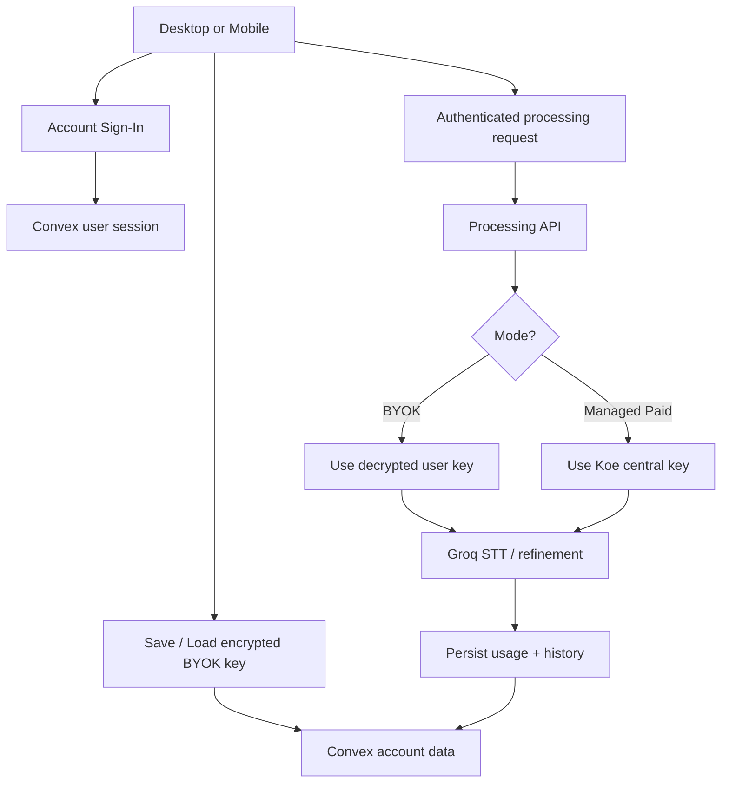

# Centralized Auth + Account Modes

## Goal

Move Koe from device-only API key usage to an account-based model that is cheap to ship now, supports cross-device sync, and leaves a clean path to desktop/web monetization later.

## Final Product Split

### Desktop / Web

- `BYOK` mode is supported
- `Koe-managed paid` mode is supported later
- account login unlocks cross-device sync
- local guest mode may remain for developer convenience, but account mode becomes the default path for real users

### Mobile

- `BYOK` only for now
- no paid unlocks inside the mobile app
- no Apple / Google native subscriptions in this rollout
- login exists so the same user can sync their BYOK key, settings, and history across devices

## Why This Product Split

- it avoids App Store / Play billing complexity right now
- it avoids paying for central API usage on mobile users who bring their own keys
- it still gives regular users an account and a smoother onboarding path
- it preserves a future desktop/web revenue path without blocking this release

## Budget-First Stack Recommendation

Use:

- `Convex` for auth-compatible backend logic, shared state, and sync
- `Paystack` later for desktop/web billing
- a small `processing API` for transcript execution and future managed billing mode

Do not use right now:

- native mobile subscriptions
- RevenueCat
- Stripe Billing
- App Store / Play paid feature unlocks

## Important Platform Rules

- Apple requires in-app purchase if we unlock app features or functionality inside the iOS app
- Google Play requires Play Billing for Play-distributed apps that charge for digital features or services
- because of that, mobile should stay `BYOK only` in this phase
- desktop and web are where we can safely introduce `Koe-managed paid` later using Paystack

## Account Modes

### Mode A: BYOK

- user signs in
- user saves their Groq API key once
- key is encrypted and synced to their account
- desktop and mobile both use the same account key after login
- Koe does not pay for this user's inference

### Mode B: Koe-Managed Paid

- desktop/web only in the near-term roadmap
- user signs in
- user pays through Paystack on web or desktop web flow
- account gets an active managed entitlement
- transcription requests use Koe's central Groq key
- server meters usage and enforces plan limits

## Non-Goals For This Release

- no mobile subscriptions
- no Apple in-app purchase work
- no Google Play Billing work
- no top-up credit packs
- no multi-seat billing
- no team accounts

## Shared State

### Sync Across Desktop + Mobile

- account profile
- encrypted BYOK credential
- transcription language
- prompt style
- custom prompt
- enhancement preference
- transcript history
- usage summaries

### Stay Local Only

- desktop hotkey
- desktop auto-paste configuration
- OS-level permissions state
- pending local audio retry blobs
- temporary audio cache
- floating window position

## Components

### Client

#### Desktop

- login / logout
- account status UI
- mode display:
  - BYOK
  - managed paid when available
- remote credential sync
- remote settings sync
- processing requests authenticated with account session

#### Mobile

- login / logout
- BYOK credential add / update / remove
- synced settings and history
- authenticated transcript requests
- no paid-mode UI

#### Website

- account landing page
- future Paystack checkout surface
- future entitlement management

### Server

#### Convex Backend

- user identity mapping
- device registry
- encrypted credential vault metadata
- synced settings
- synced history
- usage summaries
- future entitlement storage

#### Processing API

- verify account token
- resolve active account mode
- fetch BYOK credential when needed
- later fetch Koe-managed key when entitlement is active
- execute transcription and refinement
- persist history / usage events

## Data Flow



## Database Schema

```ts
interface UserAccount {
  id: string;
  email: string;
  displayName: string | null;
  createdAt: string;
  defaultMode: 'byok' | 'managed';
}

interface UserDevice {
  id: string;
  userId: string;
  platform: 'desktop' | 'ios' | 'android' | 'web';
  label: string | null;
  lastSeenAt: string;
}

interface UserCredential {
  id: string;
  userId: string;
  provider: 'groq';
  encryptedSecret: string;
  encryptionVersion: number;
  createdAt: string;
  updatedAt: string;
}

interface UserSettings {
  userId: string;
  language: string;
  promptStyle: string;
  customPrompt: string;
  enhanceText: boolean;
}

interface TranscriptEntry {
  id: string;
  userId: string;
  deviceId: string | null;
  rawText: string;
  refinedText: string | null;
  audioSeconds: number;
  createdAt: string;
}

interface UsageEvent {
  id: string;
  userId: string;
  deviceId: string | null;
  mode: 'byok' | 'managed';
  audioSeconds: number;
  requestId: string;
  createdAt: string;
}

interface BillingEntitlement {
  id: string;
  userId: string;
  status: 'inactive' | 'active';
  provider: 'paystack';
  planCode: string | null;
  periodEndsAt: string | null;
}
```

## Security Rules

- never expose the raw Koe-managed Groq key to clients
- never log BYOK secrets
- store synced BYOK credentials encrypted at rest
- use envelope encryption so credential rotation is possible
- make server-side mode resolution authoritative
- keep usage and history writes tied to authenticated users

## Cost Model Right Now

### Needed To Ship Phase 1

- Convex free tier can likely cover early auth + sync work
- existing hosting or a tiny processing host
- Groq costs only for users on any future managed plan

### Not Needed Yet

- Apple IAP setup
- Google Play Billing setup
- RevenueCat
- Stripe Billing

## Phase Roadmap

### Phase 1: Account Auth + Synced BYOK

- add login
- add synced encrypted BYOK storage
- add shared settings and history
- keep mobile BYOK-only
- keep managed billing out of scope

### Phase 2: Desktop/Web Managed Paid

- add Paystack checkout
- add entitlement storage
- add Koe-managed central key path
- add plan enforcement and usage caps

### Phase 3: Optional Mobile Monetization

- only revisit if user growth justifies App Store / Play billing work

## Risks

- credential sync adds security responsibility we do not have today
- auth rollout touches onboarding on both desktop and mobile
- desktop and mobile settings models are not identical, so sync boundaries must stay explicit
- if managed mode is partially exposed before Paystack is complete, users will get confused

## Recommendation

Ship the cheap path first:

- `account auth`
- `synced encrypted BYOK`
- `mobile BYOK-only`
- `desktop BYOK now, managed paid later`

This gives Koe a real user account system without forcing expensive billing or store work before the product has traction.
