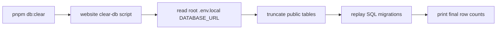

# Database Clear Command

## Goal

Provide a short local command for resetting the Neon-backed website database during development:

```powershell
pnpm db:clear
```

## Components

### Client

- No app UI changes.

### Server / Tooling

- Root `package.json`
  - Adds `db:clear` and delegates to the website workspace.
- `koe-website/package.json`
  - Adds a local `db:clear` script.
- `koe-website/scripts/clear-db.mjs`
  - Reads root `.env.local` for `DATABASE_URL`.
  - Truncates all public tables with `RESTART IDENTITY CASCADE`.
  - Replays `koe-website/db/migrations/*.sql` so schema and seed rows are restored.

## Data Flow



## Database Schema

- No schema changes.
- The command restores the current migration-defined schema after clearing data.

## Regression Checks

- `pnpm --filter website type-check` should still pass.
- `pnpm db:clear` should leave application data tables empty and restore the 3 seeded `billing_plans` rows.
