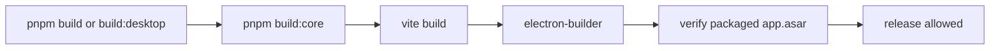

# Desktop Packaging Reliability

## Goal
- Prevent desktop releases from shipping without the built `@koe/core` workspace package.
- Catch broken or incomplete Electron payloads before a client installs them.
- Reduce the chance that auto-updated clients land on an app bundle that starts with `Cannot find module '@koe/core/dist/index.js'`.

## Components

### Client
- No renderer UI changes.

### Server / Tooling
- `package.json`
  - Builds `@koe/core` before every desktop packaging command.
  - Verifies packaged output after Electron Builder completes.
- `scripts/verify-packaged-desktop.js`
  - Finds packaged `app.asar` files in the configured desktop output folder.
  - Confirms `node_modules/@koe/core/dist/index.js` exists inside each archive.
  - Fails the build if the packaged archive is missing the core module.
  - Uses the `@electron/asar` Node API directly so verification works in CI on both Windows and macOS.

## Data Flow

## Database Schema
- No schema changes.

## Regression Checks
- Desktop build commands should no longer rely on stale workspace output from a previous local session.
- A packaged app missing `node_modules/@koe/core/dist/index.js` should fail release-time verification.
- The verification step should work against generated `release` app bundles on both Windows and macOS.

## Notes
- The observed client error is consistent with either:
  - a packaged build created without fresh `@koe/core` output, or
  - a client install/update ending up with an incomplete `app.asar`.
- This hardening addresses the first case directly and gives us a deterministic release check that would also flag a locally reproducible packaging regression before distribution.
