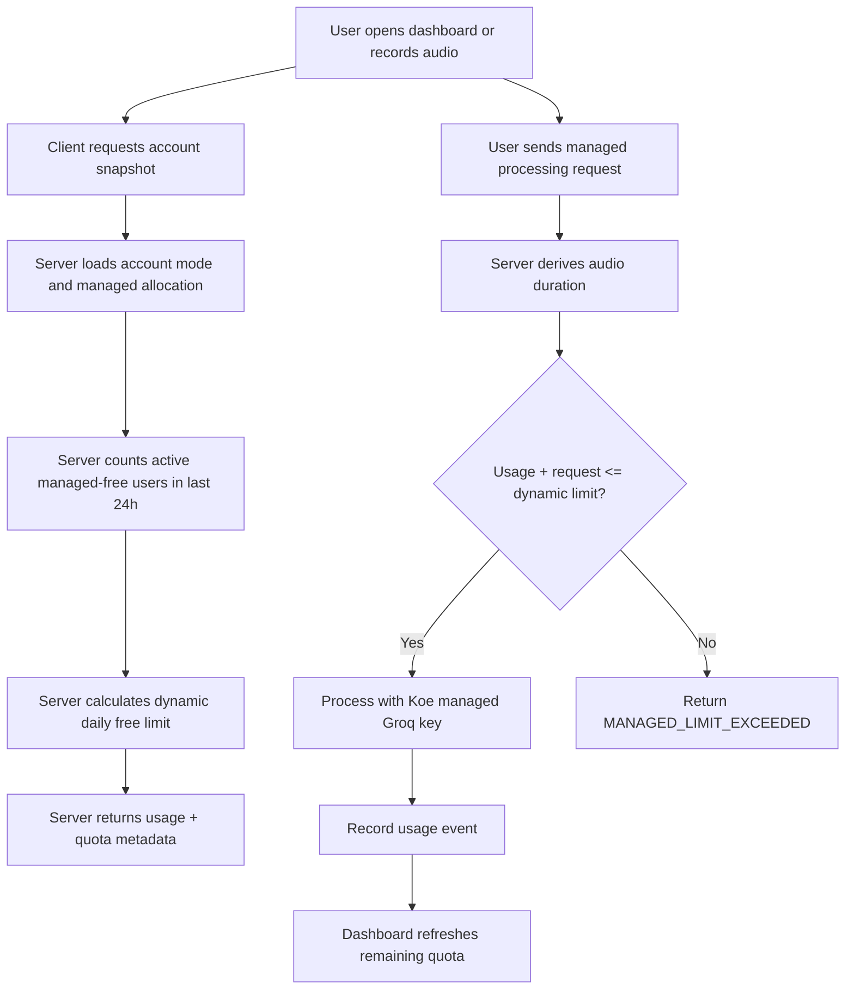

# Managed Free Tier Dynamic Quota

## Goal

Give Koe-managed free users a predictable minimum daily allowance while letting low-traffic periods feel generous.

The product rule:

- every signed-in managed-free user gets at least 5 minutes of audio per day when managed processing is enabled
- if the shared managed pool is quiet, the user can receive bonus free usage
- BYOK users continue to use their own provider quota and are not governed by the Koe managed pool
- paid managed users later receive limits from their paid entitlement, not from the shared free pool

## Decision

Use a hybrid quota:

```txt
safeDailyPoolSeconds = providerDailyAudioSeconds * poolSafetyRatio
rawDynamicLimit = floor(safeDailyPoolSeconds / activeManagedUsers24h)
freeDailyLimit = clamp(rawDynamicLimit, guaranteedFloorSeconds, bonusCeilingSeconds)
```

Initial defaults:

```txt
providerDailyAudioSeconds = 28,800
poolSafetyRatio = 0.70
safeDailyPoolSeconds = 20,160
guaranteedFloorSeconds = 300
bonusCeilingSeconds = 7,200
```

This means:

| Active managed users in last 24h | Computed daily free limit |
|---:|---:|
| 1 | 120 min |
| 5 | 67.2 min |
| 10 | 33.6 min |
| 50 | 6.7 min |
| 67+ | 5 min floor |

## Components

### Server

Source of truth for managed quota decisions.

Likely files:

- `koe-website/lib/server/account-mode.ts`
- `koe-website/lib/server/usage.ts`
- `koe-website/app/api/v1/account/usage/route.ts`
- `koe-website/app/api/v1/account/snapshot/route.ts`
- `koe-website/app/api/v1/process/route.ts`

Responsibilities:

- count active managed-free users over the last 24 hours
- calculate the current free daily limit
- enforce the calculated daily audio/request limit before processing
- return quota metadata in account snapshot and usage responses
- keep paid entitlement limits separate from managed-free dynamic limits

### Desktop

Desktop should show the managed free quota in the existing usage dashboard when the signed-in account is using managed mode.

Likely files:

- `src/renderer/components/usage-meter.js`
- `src/main/services/account-client.js`
- `src/main/services/account-processing.js`

Responsibilities:

- display managed audio used / current daily limit
- show that BYOK uses the user's own key quota
- refresh quota after a managed transcription completes

### Web App

The web app account panel should show the same server-computed managed quota.

Likely files:

- `koe-website/components/web-app/AccountPanel.tsx`
- `koe-website/components/web-app/types.ts`
- `koe-website/components/web-app/WebKoeApp.tsx`

Responsibilities:

- display "Guaranteed 5 min/day" plus current bonus limit when available
- show remaining managed-free time in account mode
- avoid implying managed-free is unlimited

### Mobile

Mobile is BYOK-first for monetization, but if managed mode is visible in account capabilities, the mobile UI should display the same quota metadata rather than inventing a local value.

Likely files:

- `apps/mobile/src/api/account-client.ts`
- `apps/mobile/src/components/AccountAuthCard.tsx`
- `apps/mobile/app/settings.tsx`
- `apps/mobile/app/index.tsx`

Responsibilities:

- consume quota metadata from account snapshot
- display current managed-free remaining time only if managed mode is available
- keep paid mobile purchase UI out of scope

## Data Flow



## Database Schema

No new table is required for the first implementation if we calculate activity from existing `usage_events`.

Existing tables used:

```ts
interface UsageEvent {
  userId: string;
  mode: "byok" | "managed";
  action: "process" | "transcription" | "refinement";
  audioSeconds: number;
  status: "success" | "error";
  createdAt: string;
}

interface ManagedAllocation {
  userId: string;
  status: "active" | "suspended" | "canceled";
  source: "default_free" | string;
  planCode: string | null;
  monthlyAudioSeconds: number;
  monthlyRequestCount: number;
}
```

Recommended response shape addition:

```ts
interface ManagedUsage {
  audioSecondsUsed: number;
  audioSecondsLimit: number;
  requestCountUsed: number;
  requestCountLimit: number;
  quotaWindow: "daily" | "monthly";
  guaranteedFloorSeconds?: number;
  bonusCeilingSeconds?: number;
  activeManagedUsers24h?: number;
  source: "dynamic_free" | "allocation" | "paid";
}
```

## Quota Rules

- Dynamic quota applies only to managed allocations with `source = "default_free"` or `planCode = "free_daily"`.
- BYOK usage is shown separately and never consumes Koe managed quota.
- Future paid managed plans bypass the dynamic shared pool and use entitlement limits.
- The server enforces quota using the derived server audio duration where possible.
- If server duration cannot be derived, managed processing may use the client estimate, matching the existing account-mode behavior.
- Request limits should exist as a secondary abuse guard, but audio seconds are the main product-facing quota.

## Dashboard Copy

Use plain, non-confusing copy:

- "5 min/day guaranteed"
- "Bonus free time available while the shared pool is quiet"
- "Current free limit: 67 min today"
- "BYOK uses your own Groq quota"

Avoid:

- "Unlimited"
- "Free forever" for managed mode
- showing wildly precise values like `4032 seconds` to users

## Implementation Plan

1. [x] Add shared quota calculation helpers on the server.
2. [x] Update account capabilities and usage endpoints to return dynamic quota metadata.
3. [x] Enforce the dynamic free quota in the managed processing path.
4. [x] Update the web account panel to show current limit and remaining time.
5. [x] Update desktop account/usage dashboard to show managed-free quota when signed in.
6. [x] Update mobile account types and visible account UI to display server quota metadata.
7. [x] Add focused verification through TypeScript and build checks.
8. [x] Update docs after implementation with the final behavior.

## Implementation Notes

Implemented server-side in `koe-website/lib/server/managed-free-quota.ts`.

The first shipped behavior uses:

- successful managed usage events in the last 24 hours to estimate active managed-free users
- the current user as active when calculating their own quota, even before their first request of the day
- existing `usage_events` rows since the current day boundary for daily free usage
- existing monthly allocation behavior for non-free managed allocations

The account snapshot and usage API now return:

- `quotaWindow`
- `guaranteedFloorSeconds`
- `bonusCeilingSeconds`
- `activeManagedUsers24h`
- `safeDailyPoolSeconds`
- `source`

Clients updated:

- web app account panel shows remaining daily managed-free time and the guaranteed floor
- desktop account snapshot and usage tab show managed-free remaining time when signed in
- mobile settings account snapshot shows the same server-computed managed quota text

Config knobs were added to `.env.example`:

```txt
KOE_MANAGED_FREE_PROVIDER_DAILY_AUDIO_SECONDS=28800
KOE_MANAGED_FREE_POOL_SAFETY_RATIO=0.70
KOE_MANAGED_FREE_GUARANTEED_SECONDS=300
KOE_MANAGED_FREE_BONUS_CEILING_SECONDS=7200
KOE_MANAGED_FREE_MIN_DAILY_REQUESTS=30
KOE_MANAGED_FREE_MAX_DAILY_REQUESTS=720
```

Verification run:

- `pnpm --filter website type-check`
- `pnpm --filter koe-mobile type-check`
- `pnpm type-check`
- `pnpm build:website`
- `pnpm exec vite build`

## Open Questions

- The bonus ceiling is currently 120 minutes/day by default.
- Active managed users currently means users with successful managed usage in the last 24 hours, plus the current user for their own calculation.
- Public demo remains separate from this signed-in managed-free quota.

## Regression Checks

- BYOK mode must continue to work without managed allocation.
- Desktop local BYOK must not depend on the website account quota API.
- Mobile must not introduce paid unlock UI in this phase.
- Web public demo must remain separately restricted by per-IP limits.
