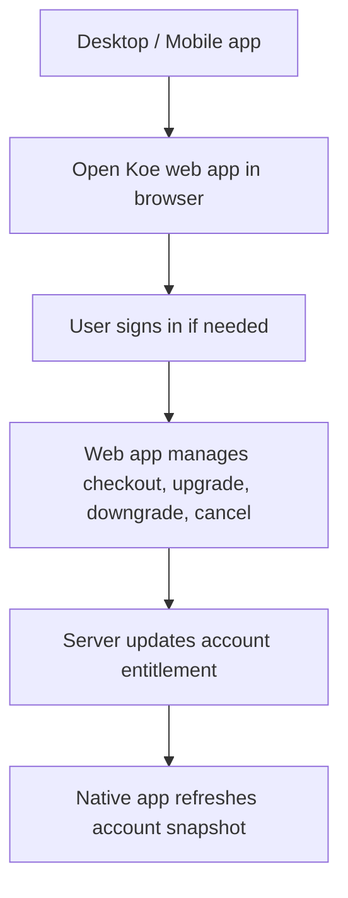

# Native Web Billing Redirect

## Goal

Keep Paystack checkout and subscription management centralized in the hosted web app while making desktop and mobile users aware of the web account page.

## Components

### Desktop Electron

- Add a settings account action that opens the Koe web app account page in the system browser.
- Reuse the configured account backend origin when present, so local development opens local web and production opens `https://www.koevoice.xyz/app`.
- Do not embed Paystack checkout inside Electron.

### Expo Mobile

- Add a signed-in account action that opens the Koe web account page in the system browser.
- Use neutral copy on mobile: the mobile app links to account management, not an in-app purchase surface.
- Do not add App Store IAP, Play Billing, RevenueCat, or native Paystack checkout.

## Data Flow

## Database Schema

No schema changes.

Native clients consume the same account snapshot and managed entitlement already returned by the website backend.

## Acceptance Criteria

- [x] Desktop settings exposes a browser handoff for billing/account management.
- [x] Mobile signed-in settings exposes a browser handoff for account management.
- [x] Native clients do not call Paystack checkout APIs directly.
- [x] Existing managed entitlement consumption remains unchanged.

## Implementation Notes

- Desktop adds `account:open-web-billing` IPC and opens the resolved web app URL with `shell.openExternal`.
- Desktop settings account actions now include `Manage Billing`.
- Mobile account settings now include `Open Koe account on web` for signed-in users.
- Mobile copy remains account-management oriented instead of native purchase oriented.
- Both native clients derive the web origin from their existing backend configuration, so local development can point at localhost and production points at `https://www.koevoice.xyz/app`.

## Verification

- Desktop main/preload CommonJS files pass `node --check`.
- `pnpm --filter koe-mobile type-check` passes.
- `pnpm exec vite build` passes for the Electron renderer/settings bundle.
