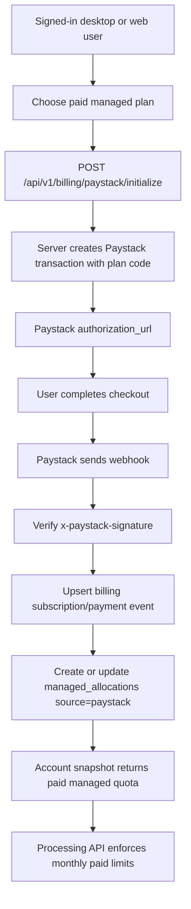

# Paystack Managed Billing

## Goal

Add paid managed processing for desktop and web users who do not want to bring their own Groq API key.

The product should stay clear:

- BYOK remains free from Koe.
- Managed free remains a small quota for trial and occasional use.
- Managed paid unlocks higher account quotas through Paystack.
- Mobile does not show paid unlock UI in this phase.

## Research Snapshot

Checked on June 6, 2026.

### Competitor Pricing

| Product | Public price | Notes |
|---|---:|---|
| Wispr Flow | $15/month, or $12/user/month billed annually | Free tier is capped by words; Pro advertises unlimited words across Mac, Windows, iPhone, and Android. Source: https://wisprflow.ai/business |
| Superwhisper Pro | $8.49/month, $84.99/year, or $249.99 lifetime | One license works across Mac, Windows, iPhone, and iPad. Source: https://superwhisper.com/docs/get-started/sw-pro |
| Aqua Voice | Commonly listed at $8/month or $96/year | Free tier is a small 1,000-word trial; official plan page is app-rendered, so use this as a market signal rather than a final quoted source. Source checked: https://withaqua.com/plans and public FAQ at https://withaqua.com/faq |
| Apple Dictation | Free | Built into Apple platforms, but not the same cross-app AI cleanup/account product. |

Positioning takeaway:

- Koe should not try to beat free OS dictation on price alone.
- A useful paid plan should sit below Wispr Flow and near or below Aqua/Superwhisper monthly pricing.
- Koe's durable wedge is open-source BYOK plus optional managed processing, not "unlimited" claims.

### Provider Pricing

Groq pricing checked from https://groq.com/pricing:

- Whisper Large v3 Turbo: $0.04 per transcribed hour.
- Whisper V3 Large: $0.111 per transcribed hour.
- Audio is billed at a minimum of 10 seconds per request.
- Llama 3.1 8B Instant: $0.05 per 1M input tokens and $0.08 per 1M output tokens.
- Llama 3.3 70B Versatile: $0.59 per 1M input tokens and $0.79 per 1M output tokens.

Paystack pricing checked from https://paystack.com/pricing and https://support.paystack.com/en/articles/2130306:

- Nigeria local transactions: 1.5% + NGN 100, capped at NGN 2,000; NGN 100 waived below NGN 2,500.
- Nigeria international cards: 3.9% + NGN 100.
- Paystack subscriptions support plans, recurring billing, and subscription webhooks. Source: https://paystack.com/docs/payments/subscriptions
- Webhook events include `x-paystack-signature`, an HMAC SHA512 signature of the payload using the Paystack secret key. Source: https://paystack.com/docs/payments/webhooks

Exchange-rate assumption for planning:

- Use about NGN 1,370 per USD for rough competitor comparison.
- Keep the product prices in NGN in Paystack to avoid promising exact USD parity.

## Cost Model

### Audio Cost

Raw Groq ASR cost:

```txt
Whisper Large v3 Turbo = $0.04 / audio hour
```

The risk is Groq's 10-second minimum per request. If Koe sends many 3-5 second managed chunks, billed audio can be 2x to 3.3x real audio.

For pricing, use a conservative managed reserve:

```txt
effective STT reserve = $0.08 / real audio hour
```

This assumes managed traffic is usually chunked at or above 10 seconds, but leaves room for some short utterances.

### Refinement Cost

Assume one audio hour produces roughly:

```txt
9,000 spoken words
15,000 input tokens to the refinement model
12,000 output tokens from the refinement model
```

Using Groq Llama 3.1 8B Instant:

```txt
15,000 * $0.05 / 1,000,000 = $0.00075
12,000 * $0.08 / 1,000,000 = $0.00096
refinement cost = about $0.00171 / audio hour
```

Using Groq Llama 3.3 70B:

```txt
15,000 * $0.59 / 1,000,000 = $0.00885
12,000 * $0.79 / 1,000,000 = $0.00948
refinement cost = about $0.01833 / audio hour
```

Recommendation:

- Use Groq Whisper Large v3 Turbo for transcription.
- Use Groq Llama 3.1 8B Instant for default cleanup.
- Offer higher-quality refinement later as a higher tier or internal experiment.
- Do not switch STT away from Groq unless reliability becomes a problem; Groq's transcription price is already extremely low.
- OpenRouter is useful as a future text-refinement fallback, but it does not replace Groq's STT economics for this feature.

### Planning Reserve

Use this all-in internal reserve for paid plan design:

```txt
managed processing reserve = $0.125 / user audio hour
```

This includes:

- Groq Whisper v3 Turbo with short-request overhead.
- LLM cleanup.
- retries, metadata writes, webhook reconciliation, and small hosting overhead.

## Recommended Plans

Initial paid plans should be monthly, Paystack-backed, and capped. Avoid "unlimited" until there is enough usage data.

| Plan | Price | Audio cap | Request cap | Paystack local net | Max cost reserve | Gross margin |
|---|---:|---:|---:|---:|---:|---:|
| Managed Free | NGN 0 | Dynamic free quota, minimum 5 min/day | Dynamic guardrail | NGN 0 | shared pool only | n/a |
| Managed Lite | NGN 5,000/mo | 10 hours/mo | 1,000/mo | about NGN 4,825 | about $1.25 | about 64% |
| Managed Plus | NGN 9,000/mo | 25 hours/mo | 2,500/mo | about NGN 8,765 | about $3.13 | about 51% |
| Managed Pro | NGN 15,000/mo | 40 hours/mo | 4,000/mo | about NGN 14,675 | about $5.00 | about 53% |

Notes:

- Margin uses NGN 1,370/USD and the $0.125/hour reserve.
- International-card margin is lower because Paystack charges 3.9% + NGN 100. These plans still stay profitable at cap, but marketing should default to NGN local prices.
- The fixed NGN 100 fee makes very low monthly plans unattractive. Avoid plans below NGN 5,000.
- If real usage shows users regularly hit caps, either lower caps or introduce annual plans with slightly better economics.

## Components

### Client

#### Website

Likely files:

- `koe-website/app/pricing/page.tsx`
- `koe-website/components/web-app/AccountPanel.tsx`
- `koe-website/components/web-app/types.ts`

Responsibilities:

- show real paid plans instead of "Coming later"
- display current paid entitlement and period end
- start Paystack checkout from authenticated account context
- show managed quota as monthly for paid allocations
- keep mobile purchase policy copy unchanged

#### Desktop

Likely files:

- `src/renderer/settings-window.html`
- `src/renderer/settings-window.js`
- `src/renderer/components/usage-meter.js`
- `src/main/services/account-client.js`

Responsibilities:

- show paid entitlement in account status
- open the web checkout URL in the browser
- refresh account snapshot after checkout/webhook completion
- continue to use authenticated backend processing for managed mode

#### Mobile

Likely files:

- `apps/mobile/app/settings.tsx`
- `apps/mobile/src/api/account-client.ts`

Responsibilities:

- display entitlement/quota if the account already has one
- do not add in-app purchase, Paystack checkout, or paid unlock buttons
- keep `mobilePurchaseUiEnabled: false`

### Server

Likely files:

- `koe-website/app/api/v1/billing/paystack/initialize/route.ts`
- `koe-website/app/api/v1/billing/paystack/verify/route.ts`
- `koe-website/app/api/v1/billing/paystack/webhook/route.ts`
- `koe-website/lib/server/paystack.ts`
- `koe-website/lib/server/billing.ts`
- `koe-website/lib/server/account-mode.ts`
- `koe-website/db/migrations/0004_paystack_billing.sql`

Responsibilities:

- map public Koe plan ids to Paystack plan codes
- create Paystack checkout sessions through the backend
- verify transactions by reference
- verify webhook signatures with the raw request body
- upsert subscription state idempotently
- create/update `managed_allocations` with `source = 'paystack'`
- suspend or cancel allocations when recurring payment fails or subscription is disabled

## Data Flow



## Database Schema

Add billing tables instead of overloading `managed_allocations`.

```ts
interface BillingPlan {
  id: string;
  code: "managed_lite" | "managed_plus" | "managed_pro";
  paystackPlanCode: string;
  name: string;
  currency: "NGN";
  amountKobo: number;
  monthlyAudioSeconds: number;
  monthlyRequestCount: number;
  active: boolean;
  createdAt: string;
  updatedAt: string;
}

interface BillingSubscription {
  id: string;
  userId: string;
  planId: string;
  provider: "paystack";
  providerCustomerCode: string | null;
  providerSubscriptionCode: string | null;
  providerEmailToken: string | null;
  status: "pending" | "active" | "past_due" | "canceled" | "disabled";
  currentPeriodStart: string | null;
  currentPeriodEnd: string | null;
  lastPaymentReference: string | null;
  createdAt: string;
  updatedAt: string;
}

interface BillingPaymentEvent {
  id: string;
  provider: "paystack";
  eventType: string;
  reference: string | null;
  subscriptionCode: string | null;
  processedAt: string;
  payloadHash: string;
}
```

Existing table to continue using:

```ts
interface ManagedAllocation {
  source: "paystack";
  planCode: "managed_lite" | "managed_plus" | "managed_pro";
  monthlyAudioSeconds: number;
  monthlyRequestCount: number;
  periodStart: string;
  periodEnd: string;
}
```

## API Design

| Method | Endpoint | Auth | Purpose |
|---|---|---|---|
| GET | `/api/v1/billing/plans` | optional | return active public plans |
| POST | `/api/v1/billing/paystack/initialize` | required | create checkout URL for selected plan |
| POST | `/api/v1/billing/paystack/verify` | required | verify a returned transaction reference and refresh entitlement |
| POST | `/api/v1/billing/paystack/webhook` | Paystack signature | process subscription/payment events |
| POST | `/api/v1/billing/paystack/cancel` | required | disable/cancel a subscription when implemented |

## Paystack Events To Handle

Minimum:

- `charge.success`
- `subscription.create`
- `invoice.update`
- `invoice.payment_failed`
- subscription disabled/cancel events from Paystack payloads

Rules:

- Webhook processing must be idempotent.
- Do not trust callback URLs alone.
- `charge.success` can activate the first paid period.
- Failed invoice events should mark subscription `past_due` and eventually suspend the allocation.
- Unknown events should be recorded and ignored without failing the webhook.

## Environment Variables

```txt
PAYSTACK_SECRET_KEY=
PAYSTACK_PUBLIC_KEY=
PAYSTACK_WEBHOOK_SECRET=
KOE_APP_BASE_URL=
KOE_ADMIN_DASHBOARD_TOKEN=
```

Optional plan-code overrides:

```txt
PAYSTACK_PLAN_MANAGED_LITE=
PAYSTACK_PLAN_MANAGED_PLUS=
PAYSTACK_PLAN_MANAGED_PRO=
```

If Paystack uses the same secret key for webhook HMAC, `PAYSTACK_WEBHOOK_SECRET` may point to the same value, but keep the name separate for rotation clarity.

Plan codes do not need to be created manually in the Paystack dashboard. After `PAYSTACK_SECRET_KEY`, `DATABASE_URL`, and `KOE_ADMIN_DASHBOARD_TOKEN` are configured, call:

```powershell
Invoke-RestMethod `
  -Method Post `
  -Uri "https://your-domain.example/api/v1/admin/billing/paystack/reconcile-plans" `
  -Headers @{ "x-koe-admin-token" = $env:KOE_ADMIN_DASHBOARD_TOKEN }
```

The reconcile endpoint:

- reads Koe's active `billing_plans`
- finds matching Paystack monthly plans by name, amount, interval, and currency
- creates missing Paystack plans through the Paystack Plan API
- updates matching Paystack plans with the current name/amount/description
- stores the returned `plan_code` in `billing_plans.provider_plan_code`

Checkout then uses `billing_plans.provider_plan_code` unless an optional `PAYSTACK_PLAN_*` override is set.

## Implementation Plan

1. [x] Add billing migration tables for plans, subscriptions, and event idempotency.
2. [x] Add `lib/server/paystack.ts` with initialize, verify, and typed response helpers.
3. [x] Add `lib/server/billing.ts` to map Koe plans to Paystack plans and synchronize managed allocations.
4. [x] Add authenticated checkout initialize and verify endpoints.
5. [x] Add raw-body Paystack webhook endpoint with HMAC SHA512 signature verification.
6. [x] Extend account snapshot responses with billing status and paid plan metadata.
7. [x] Update website pricing page from "Coming later" to real Paystack plans.
8. [x] Update web app account panel to show current plan, usage, and checkout action.
9. [x] Update desktop account state/usage display for paid managed quota.
10. [x] Keep mobile as display-only for paid entitlements.
11. [x] Add focused verification through website TypeScript checks.
12. [x] Update this document with final implemented behavior.

## Implementation Notes

Implemented on June 6, 2026.

Server additions:

- `koe-website/db/migrations/0004_paystack_billing.sql`
- `koe-website/lib/server/paystack.ts`
- `koe-website/lib/server/billing.ts`
- `koe-website/lib/server/billing-plan-reconcile.ts`
- `koe-website/lib/server/billing-paystack-events.ts`
- `koe-website/lib/server/billing-status.ts`
- `koe-website/app/api/v1/admin/billing/paystack/reconcile-plans/route.ts`
- `koe-website/app/api/v1/billing/plans/route.ts`
- `koe-website/app/api/v1/billing/paystack/initialize/route.ts`
- `koe-website/app/api/v1/billing/paystack/verify/route.ts`
- `koe-website/app/api/v1/billing/paystack/webhook/route.ts`

Client updates:

- `/pricing` now shows Managed Lite, Plus, and Pro with NGN Paystack pricing.
- `/pricing` paid plan CTAs link to `/app?checkout=managed_lite`, `/app?checkout=managed_plus`, or `/app?checkout=managed_pro`.
- `/app` prompts signed-out users to sign in before continuing checkout, then starts the intended hosted Paystack checkout after login.
- `/app` account panel shows billing status and starts hosted Paystack checkout for signed-in users.
- `/app?billing=paystack&reference=...` verifies the Paystack return reference and refreshes the account snapshot.
- Desktop account state preserves the `billing` snapshot and labels Paystack-backed managed usage as `Managed paid`.

Billing behavior:

- Checkout initialization records a pending subscription and sends Koe metadata to Paystack.
- Manual verification and `charge.success` webhooks activate a `paystack` managed allocation.
- Webhook signature validation uses HMAC SHA512 before payload processing.
- Duplicate webhook payloads are ignored through `billing_payment_events.payload_hash`.
- `invoice.payment_failed` marks the subscription `past_due`.
- `subscription.disable` and `subscription.not_renew` disable the paid subscription and suspend active Paystack allocations.

Verification run:

- `pnpm --filter website type-check`

## Acceptance Criteria

- A signed-in desktop or web user can start Paystack checkout for a managed paid plan.
- Successful Paystack payment activates a `paystack` managed allocation with the right monthly limits.
- Account snapshot returns the active paid plan and monthly managed usage.
- Managed processing enforces paid allocation limits through the existing quota path.
- Duplicate webhook delivery does not double-count or create duplicate allocations.
- Payment failure does not immediately delete user data; it marks the billing state and disables paid processing only when rules say so.
- Mobile does not expose paid checkout UI.
- BYOK remains free and unaffected.

## Regression Checks

- Signed-out local BYOK continues to work.
- Signed-in account BYOK continues to work with no Paystack dependency.
- Managed free dynamic quota still works for `default_free` allocations.
- Public web demo remains separately rate-limited.
- Pricing copy avoids "unlimited" unless the plan truly supports it.
- No provider keys or Paystack secrets are exposed to clients.

## Open Questions

- Should annual plans launch immediately or after monthly billing is proven?
- Should failed renewals get a grace period, for example 3 days, before paid allocation suspension?
- Should Lite/Plus/Pro be shown in USD-equivalent copy, or only NGN to avoid exchange-rate drift?
- Should Pro use the higher-quality Llama 3.3 70B refinement model, or should all tiers use the same default model at launch?
