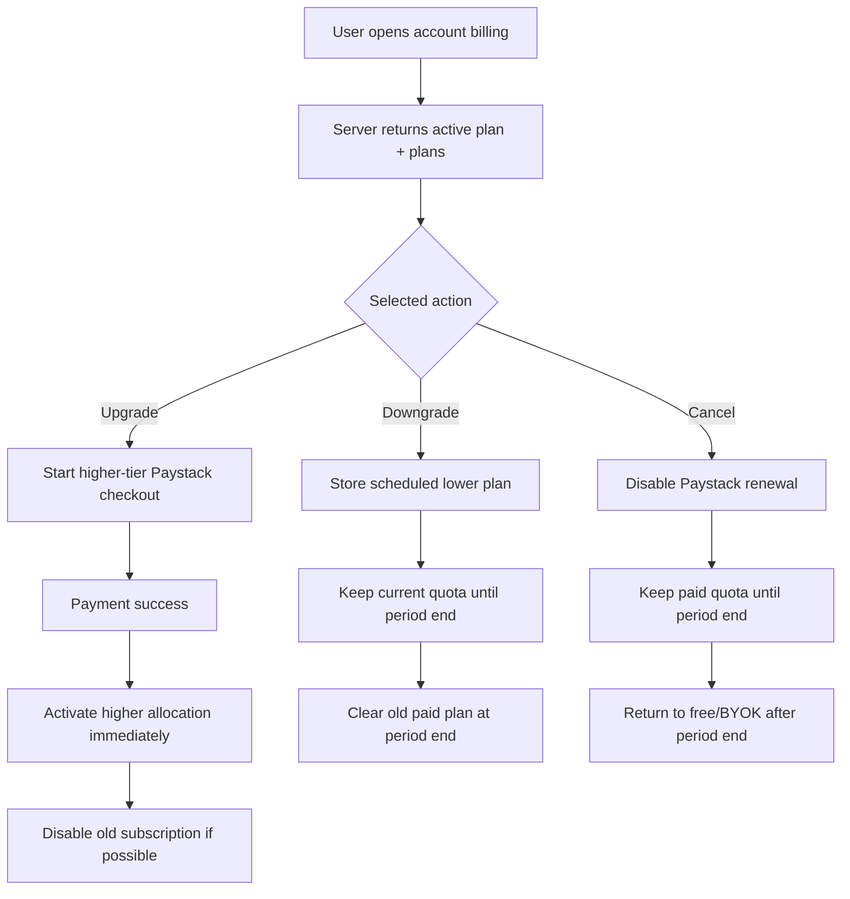

# Paystack Plan Changes

## Goal

Give paid managed users a clear way to change tiers after subscribing.

This closes the gap where a user can buy Managed Lite, Plus, or Pro, but cannot clearly upgrade, downgrade, or return to free from inside Koe.

## Product Decision

Use a simple policy first:

- upgrades to a higher paid tier are immediate
- downgrades to a lower paid tier are scheduled for the next billing period and stop the current higher-tier renewal
- canceling to free is scheduled for the end of the current billing period
- no automatic prorated refunds in the first implementation
- refunds remain admin/manual until we have real support and abuse patterns

Reason: Paystack subscriptions can be enabled/disabled and refunds can be created by API, but Paystack does not appear to provide a first-class Stripe-style proration preview/commit flow for changing one active subscription into another with exact credit math.

## Research Snapshot

Checked on June 7, 2026.

Paystack docs:

- Subscriptions API supports creating, enabling, and disabling subscriptions using subscription code and email token. Source: https://paystack.com/docs/api/subscription/
- Paystack subscription docs describe plan/subscription flows and mention changing subscription behavior around plans, but the safest API primitives exposed for user self-service are still subscription creation/enable/disable plus webhooks. Source: https://paystack.com/docs/payments/subscriptions
- Refunds can be created through Paystack's Refund API by passing a transaction id/reference, but Paystack processing fees are not returned to the business. Sources: https://docs-v2.production.paystack.co/payments/refunds/ and https://support.paystack.com/en/articles/2127106

## UX Rules

### Current Plan Display

Show:

- current plan
- current period end
- usage this period
- available actions:
  - Upgrade
  - Downgrade
  - Cancel to free

### Upgrade

If user upgrades from:

- Lite -> Plus
- Lite -> Pro
- Plus -> Pro

Then:

- start a new Paystack checkout for the higher tier
- once payment succeeds, immediately activate the higher managed allocation
- disable the previous Paystack subscription if we have `providerSubscriptionCode` and `providerEmailToken`
- mark the old subscription as `canceled` or `disabled`
- do not refund the old plan automatically

Copy:

> Your new quota starts after checkout. We do not automatically prorate or refund the previous plan.

### Downgrade

If user downgrades from:

- Pro -> Plus
- Pro -> Lite
- Plus -> Lite

Then:

- store the requested lower plan as a pending scheduled change
- keep current quota until `currentPeriodEnd`
- apply the lower tier after the current billing period ends
- clear the old paid subscription after the current period ends
- send the user through lower-tier checkout when they are ready to resume on the lower paid tier

Copy:

> Your current quota stays active until the end of this billing period. The higher-plan renewal is canceled, and you can start the lower plan checkout next period.

### Cancel To Free

If user cancels:

- disable Paystack renewal using subscription code + email token
- keep current paid quota until `currentPeriodEnd`
- after period end, return to managed-free/BYOK availability

Copy:

> Your paid quota remains available until the end of this period. After that, your account returns to free managed quota or BYOK.

### Refunds

Do not add automatic refund logic in the first self-service plan-change release.

Add admin-only/manual support later:

- full refund of latest transaction
- partial refund by amount
- refund reason stored internally

Do not advertise automatic refunds in plan-change UI.

## Components

### Client

Likely files:

- `koe-website/components/web-app/AccountPanel.tsx`
- `koe-website/components/web-app/hooks/usePaystackBilling.ts`
- `koe-website/components/web-app/types.ts`

Responsibilities:

- show all paid plans even when an active subscription exists
- disable the current plan button
- label higher plans as `Upgrade`
- label lower plans as `Downgrade next period`
- add `Cancel paid plan` action
- show pending scheduled plan change

### Server

Likely files:

- `koe-website/lib/server/billing.ts`
- `koe-website/lib/server/paystack.ts`
- `koe-website/lib/server/billing-status.ts`
- `koe-website/app/api/v1/billing/paystack/initialize/route.ts`
- `koe-website/app/api/v1/billing/paystack/change-plan/route.ts`
- `koe-website/app/api/v1/billing/paystack/cancel/route.ts`
- `koe-website/app/api/v1/billing/paystack/webhook/route.ts`
- `koe-website/db/migrations/0005_billing_plan_changes.sql`

Responsibilities:

- compare current plan rank to requested plan rank
- allow immediate checkout for upgrades
- store scheduled downgrade/cancel requests
- call Paystack disable subscription where possible
- keep account quota active until period end for downgrade/cancel
- apply scheduled changes from webhook/usage/snapshot reconciliation

## Data Flow



## Database Schema

Add scheduled change fields/table.

```ts
interface BillingPlanChange {
  id: string;
  userId: string;
  subscriptionId: string;
  fromPlanCode: "managed_lite" | "managed_plus" | "managed_pro";
  toPlanCode: "managed_lite" | "managed_plus" | "managed_pro" | "managed_free";
  changeType: "upgrade" | "downgrade" | "cancel";
  status: "pending" | "applied" | "canceled";
  effectiveAt: string;
  createdAt: string;
  updatedAt: string;
}
```

Keep existing subscription fields:

- `provider_subscription_code`
- `provider_email_token`
- `current_period_end`
- `last_payment_reference`

These are needed for Paystack disable/cancel and refund/admin flows.

## API Design

| Method | Endpoint | Purpose |
|---|---|---|
| POST | `/api/v1/billing/paystack/change-plan` | request upgrade/downgrade |
| POST | `/api/v1/billing/paystack/cancel` | cancel paid renewal and return to free at period end |
| GET | `/api/v1/account/snapshot` | return active subscription plus pending plan change |

## Implementation Plan

1. [x] Add `billing_plan_changes` migration.
2. [x] Add plan rank helpers: free < lite < plus < pro.
3. [x] Add Paystack `disableSubscription` helper.
4. [x] Add `change-plan` endpoint.
5. [x] Add `cancel` endpoint.
6. [x] Extend account snapshot with `pendingPlanChange`.
7. [x] Update account billing UI to show upgrade/downgrade/cancel actions.
8. [x] Keep automatic refunds out of scope.
9. [x] Update docs after implementation.

## Implementation Notes

- Added `0005_billing_plan_changes.sql` with one pending plan change per user.
- Added `POST /api/v1/billing/paystack/change-plan`.
  - Higher tiers return a new Paystack checkout.
  - Lower tiers disable the current Paystack renewal and store a pending downgrade.
- Added `POST /api/v1/billing/paystack/cancel`.
  - The current renewal is disabled and the user keeps paid quota until `currentPeriodEnd`.
- Account snapshot now returns `pendingPlanChange` and reconciles due scheduled changes before returning billing state.
- Paystack `subscription.disable` / `subscription.not_renew` webhooks no longer suspend paid quota when the disable belongs to a pending scheduled change.
- The account billing UI now shows current, upgrade, downgrade, and cancel actions on desktop web.
- Mobile web continues to hide paid checkout controls.

## Verification

- Applied `0005_billing_plan_changes.sql` locally through the Neon client.
- `pnpm --filter website type-check` passes.
- `pnpm build:website` passes.
- `pnpm --filter website lint` passes.
- `http://localhost:3000/app` responds with HTTP 200.

## Acceptance Criteria

- [x] User on Lite can upgrade to Plus/Pro from account billing.
- [x] User on Plus can upgrade to Pro from account billing.
- [x] User on Pro/Plus can schedule downgrade for the next billing period.
- [x] User can cancel renewal and keep paid quota until period end.
- [x] Current active plan cannot be bought again.
- [x] Mobile does not show Paystack checkout UI.
- [x] BYOK remains unaffected.

## Open Questions

- Should a scheduled downgrade require payment checkout immediately, or should we send the user through checkout only when the next period begins? Current implementation uses checkout at/after the next period.
- Should admin support partial refunds in this release, or only record manual refund notes?
- Should a user be allowed to cancel a scheduled downgrade before it applies?
