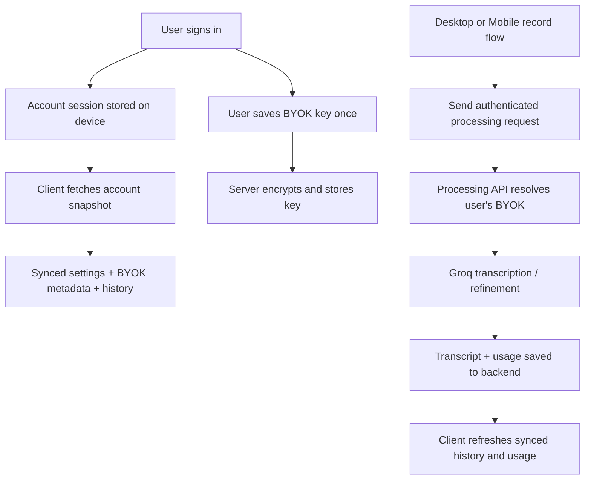

# Phase 1: Auth + Synced BYOK

## Goal

Ship account login and encrypted BYOK sync across desktop and mobile, while keeping mobile strictly BYOK-only and leaving Koe-managed paid mode for a later phase.

## Scope

### In Scope

- account sign-in and sign-out
- shared account session across Koe surfaces
- encrypted BYOK storage tied to the user account
- synced settings:
  - language
  - prompt style
  - custom prompt
  - enhancement preference
- synced transcript history
- authenticated processing requests that resolve to the user's synced BYOK key
- desktop UI and mobile UI updates for account state

### Out of Scope

- Paystack billing flow
- managed paid entitlement activation
- use of Koe central key for paid users
- App Store / Play store billing
- team accounts
- usage-based plan limits

## Product Rules

### Desktop

- user can sign in
- user can save, update, or delete a synced BYOK key
- when signed in and BYOK exists, desktop uses synced BYOK by default
- local-only guest usage may continue to exist, but Phase 1 should not depend on it

### Mobile

- user can sign in
- user can save, update, or delete a synced BYOK key
- mobile uses synced BYOK only
- mobile must not expose managed paid mode

## Technical Decision

Assumption for this phase:

- use `Convex` as the shared backend and sync layer
- keep the existing transcription pipeline structure
- add a lightweight authenticated processing path that fetches the user's synced BYOK credential server-side

If we change backend vendors later, the client abstractions should still separate:

- session/auth
- account data sync
- processing transport

## Components

### Client

#### Desktop

Files likely involved:

- `src/main/services/settings.js`
- `src/main/services/groq.js`
- `src/main/ipc.js`
- `src/main/preload.js`
- `src/renderer/components/settings-panel.js`
- `src/renderer/index.js`

Responsibilities:

- account sign-in / sign-out triggers
- account session persistence
- BYOK credential UI
- synced settings load/save
- authenticated transcript requests

#### Mobile

Files likely involved:

- `apps/mobile/app/onboarding.tsx`
- `apps/mobile/app/settings.tsx`
- `apps/mobile/src/storage/secure-storage.ts`
- `apps/mobile/src/storage/settings-storage.ts`
- `apps/mobile/src/storage/history-storage.ts`
- `apps/mobile/src/providers/mobile-provider.ts`
- `apps/mobile/src/hooks/use-recording-pipeline.ts`

Responsibilities:

- account sign-in / sign-out
- BYOK credential UI
- synced settings and history
- removal of device-only key assumptions
- authenticated transcript requests

#### Shared Core

Files likely involved:

- `packages/koe-core/src/types/settings.ts`
- `packages/koe-core/src/constants.ts`

Responsibilities:

- shared mode constants
- shared account/session types if needed
- request payload shapes

### Server

#### Convex

New ownership area:

- `convex/` workspace or equivalent backend directory

Responsibilities:

- user profile lookup
- device registration
- encrypted BYOK credential storage
- settings sync
- history sync
- usage event storage

#### Processing API

Responsibilities:

- validate account token
- read encrypted BYOK metadata for the user
- decrypt BYOK on the server
- call Groq with the user's key
- persist transcript result and usage event

## Data Flow



## Database Schema

```ts
interface UserAccount {
  id: string;
  email: string;
  displayName: string | null;
  createdAt: string;
}

interface UserDevice {
  id: string;
  userId: string;
  platform: 'desktop' | 'ios' | 'android' | 'web';
  label: string | null;
  lastSeenAt: string;
}

interface UserCredential {
  id: string;
  userId: string;
  provider: 'groq';
  encryptedSecret: string;
  encryptionVersion: number;
  createdAt: string;
  updatedAt: string;
}

interface UserSettings {
  userId: string;
  language: string;
  promptStyle: string;
  customPrompt: string;
  enhanceText: boolean;
}

interface TranscriptEntry {
  id: string;
  userId: string;
  deviceId: string | null;
  rawText: string;
  refinedText: string | null;
  audioSeconds: number;
  createdAt: string;
}

interface UsageEvent {
  id: string;
  userId: string;
  deviceId: string | null;
  mode: 'byok';
  audioSeconds: number;
  requestId: string;
  createdAt: string;
}
```

## API Surface

### Account / Session

- `getAccountSnapshot`
- `saveSyncedSettings`
- `registerDevice`
- `listHistory`

### Credential Vault

- `upsertGroqCredential`
- `deleteGroqCredential`
- `hasGroqCredential`

### Processing

- `POST /v1/process/byok`

Request:

- authenticated user token
- device id
- audio payload
- prompt settings override if needed

Response:

- raw transcript
- refined transcript
- updated usage summary
- optional latest history id

## UI Changes

### Desktop

- replace "add your Groq key locally" as the main path with "sign in to sync your key"
- keep any local/dev-only API key controls clearly separated from the account path
- show account card:
  - signed out
  - signed in, no BYOK key
  - signed in, BYOK ready

### Mobile

- onboarding copy changes from "configure your own API key in settings" to "sign in and add your key once"
- settings gets account section and BYOK section
- recording should block with a clear error if signed in account has no BYOK key configured

## Implementation Tasks

### Task 1: Backend Foundation

Owner:

- backend agent

Write scope:

- new backend directory and config
- shared schema/types if needed

Deliverables:

- account schema
- device schema
- credential schema
- settings schema
- history schema
- mutations and queries for account snapshot and BYOK storage

### Task 2: Desktop Account Flow

Owner:

- desktop agent

Write scope:

- `src/main/**`
- `src/renderer/**`
- desktop-related shared types only if necessary

Deliverables:

- desktop sign-in flow
- session persistence
- account status UI
- BYOK save/update/delete UI
- settings sync wiring

### Task 3: Mobile Account Flow

Owner:

- mobile agent

Write scope:

- `apps/mobile/**`
- mobile-related shared types only if necessary

Deliverables:

- mobile sign-in flow
- session persistence
- onboarding update
- BYOK save/update/delete UI
- synced settings/history wiring

### Task 4: Authenticated Processing Path

Owner:

- backend / processing agent

Write scope:

- processing API implementation
- integration points in desktop and mobile provider paths

Deliverables:

- account-authenticated transcript endpoint
- server-side BYOK resolution
- transcript persistence
- usage event persistence

### Task 5: Docs + QA

Owner:

- verification / docs agent

Write scope:

- docs updates
- test-result notes

Deliverables:

- updated setup docs
- rollout checklist
- regression notes

## Acceptance Criteria

- a user can sign in on desktop
- a user can sign in on mobile
- a user can save one Groq API key to their account
- the same account can use that key on another device without retyping it
- desktop transcript requests work through the authenticated BYOK path
- mobile transcript requests work through the authenticated BYOK path
- synced settings load correctly on both devices
- synced transcript history is visible on both devices
- deleting the synced BYOK key blocks transcription on both devices until a new key is saved
- mobile shows no managed paid UI and no store-purchase UI

## Regression Checks

- existing local recording, chunking, and retry behavior must still work
- desktop local-only hotkey and auto-paste settings must not be overwritten by sync
- mobile retry state must remain local and resilient across app restarts
- transcript refinement must still respect current prompt-style behavior
- no logs may print raw API keys or auth tokens

## Testing Matrix

### Happy Paths

- desktop sign in -> add BYOK -> transcribe successfully
- mobile sign in -> pick up existing BYOK -> transcribe successfully
- mobile add BYOK first -> desktop picks it up -> transcribe successfully
- settings changed on one device appear on the other

### Failure Paths

- signed in with no BYOK key
- expired or invalid BYOK key
- processing API unavailable
- backend snapshot unavailable on first app launch
- sign out clears device session and access to synced BYOK usage

## Release Gate

Phase 1 is shippable when:

- auth works on desktop and mobile
- synced BYOK works end-to-end
- mobile remains BYOK-only
- no paid-mode UX leaks into mobile
- docs are updated

## Follow-On Phase

After Phase 1 ships, the next build doc should be:

- `Phase 2: Desktop/Web Managed Paid via Paystack`

That phase will add:

- Paystack checkout
- entitlement activation
- Koe-managed central key path
- plan enforcement
