# Pill UI & Auto-Paste System

## Overview
Koe's primary interface is a **non-focusable, bottom-anchored pill** (400×68px) that slides up on hotkey press. It shows recording/processing/done states and auto-hides after pasting transcribed text at the user's cursor. Settings and history are accessed from the system tray.

## Architecture
- **Main Process:** `src/main/main.js` (window), `shortcuts.js` (hotkey), `tray.js` (system tray), `ipc.js` (pipeline)
- **Renderer:** `src/renderer/index.html`, `index.js`, `components/pill-ui.js`
- **Styles:** `src/renderer/styles/main.css` (tokens), `floating.css` (pill states)
- **Services:** `src/main/services/clipboard.js` (auto-paste via .NET SendKeys)

## Key Components

### Pill Window (`main.js`)
- 400×68 frameless, transparent, `alwaysOnTop`, `skipTaskbar`
- **`focusable: false`** — never steals focus from user's active app
- **`showInactive()`** — appears without taking focus
- Positioned at bottom-center of primary display

### Pill UI (`pill-ui.js`)
4 states with CSS transitions:
| State | Visual | Trigger |
|-------|--------|---------|
| `idle` | Muted mic icon, "Ready" | Default |
| `recording` | Red glow, pulse dot, visualizer bars, timer | Hotkey start |
| `processing` | Purple glow, spinner | Hotkey stop |
| `done` | Green flash, animated checkmark, "Pasted ✓" | Transcription complete |

### Auto-Paste Pipeline (`ipc.js` → `clipboard.js`)
1. Groq returns transcription → LLM enhances text
2. `mainWindow.hide()` — pill disappears
3. 200ms delay — OS restores focus to user's app
4. `clipboard.writeText(text)` → `SendKeys::SendWait('^v')` — pastes at cursor
5. IPC sends `TRANSCRIPTION_COMPLETE` → pill shows "done" briefly

### Force-Flush (`vad.js`)
Collects speech frames via `onFrameProcessed` during recording. On manual hotkey stop, concatenates all frames into a WAV and sends — ensures no audio is lost when user stops mid-speech.

## Data Flow

```mermaid
flowchart LR
    A[Hotkey] --> B[Pill slides up]
    B --> C[VAD records speech]
    C --> D[Hotkey stop → flush frames]
    D --> E[WAV → Groq Whisper]
    E --> F[LLM Enhancement]
    F --> G[Hide pill → restore focus]
    G --> H[SendKeys Ctrl+V → paste]
    H --> I[Pill: Done ✓ → auto-hide]
```

## Hotfixes / Changelog

### 2026-03-02: VAD Force-Flush
- **Problem:** Pressing hotkey to stop mid-speech discarded buffered audio (MicVAD `pause()` doesn't flush)
- **Solution:** Collect frames via `onFrameProcessed`, manually encode and send on stop

### 2026-03-02: Focus Stealing Fix
- **Problem:** `mainWindow.show()` stole focus from user's app, breaking cursor position and auto-paste
- **Solution:** `focusable: false` + `showInactive()` everywhere

### 2026-03-02: PowerShell SendKeys Quote Fix
- **Problem:** `"^v"` inner quotes stripped by `exec()` shell, causing parse error
- **Solution:** Use single quotes `'^v'` inside PowerShell command
