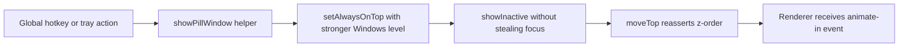

# Pill Window Z-Order Hardening

## Goal
- Keep the desktop transcription pill reliably visible when the user triggers the hotkey, even if other Windows apps use aggressive top-most behavior.
- Preserve the existing non-focus-stealing UX so dictation can still paste back into the previously active app.

## Components

### Client
- Existing pill renderer remains unchanged.
- Renderer still animates in when the main process shows the pill window.

### Server / Main Process
- `src/main/main.js`
  - Creates the pill window and applies stronger always-on-top behavior during setup.
- `src/main/services/pill-window.js`
  - Centralizes pill bounds, z-order level, and safe show/re-pin helpers.
- `src/main/shortcuts.js`
  - Uses the shared show helper when the recording hotkey starts a session or retry UI is displayed.
- `src/main/tray.js`
  - Uses the shared show helper when the tray toggles or starts recording.

## Data Flow

## Database Schema
- No database or settings schema changes.

## Regression Checks
- The pill must remain `focusable: false`.
- Showing the pill must continue using `showInactive()` so the cursor stays in the user’s active app.
- Hide and auto-paste flows must keep working unchanged.

## Implementation Notes
- On Windows, use a higher Electron always-on-top level so the pill is not left at the default lower tier.
- Reapply top-most status and call `moveTop()` whenever the pill is shown to recover from z-order drift after long app sessions.
