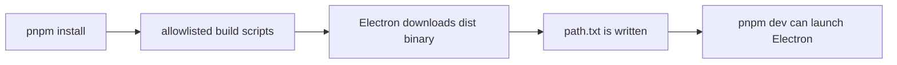

# PNPM Build Script Allowlist

## Goal
- Ensure local development works on pnpm 10+, where install/build scripts may be blocked unless explicitly allowed.
- Prevent Electron from being left in a half-installed state that breaks `pnpm dev`.

## Components

### Client
- No renderer changes.

### Server / Tooling
- `package.json`
  - Adds `pnpm.onlyBuiltDependencies` so Electron and related build-time dependencies can run their install scripts.
- `README.md`
  - Documents the recovery command for existing installs that already skipped these scripts.

## Data Flow

## Database Schema
- No schema changes.

## Regression Checks
- Fresh installs should no longer report `Electron failed to install correctly`.
- Existing installs should recover with `pnpm rebuild electron esbuild protobufjs electron-winstaller`.
