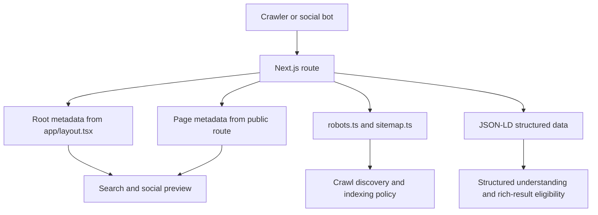

# SEO Optimization and Best Practices Pass

## Goal

Make the `koe-website` Next.js app production-grade for SEO, social sharing, crawlability, accessibility, performance, and current framework best practices.

This pass is focused on the public website and account-adjacent web routes, not the Electron desktop renderer or mobile app UI.

Production URL: `https://koevoice.xyz/`.

## Current Audit Baseline

- `pnpm --dir koe-website type-check` passes.
- `pnpm --dir koe-website lint` fails because `components/web-app/AccountPanel.tsx` has an unescaped apostrophe.
- Lint also reports custom Google font loading in `app/layout.tsx`, unused imports in `Navbar.tsx`, and unused imports in `components/sections/Comparison.tsx`.
- Root metadata, sitemap, robots, manifest, Open Graph, Twitter metadata, and SoftwareApplication JSON-LD already exist.
- `public/robots.txt`, `public/sitemap.xml`, and `public/manifest.json` duplicate generated App Router files and can become stale.
- Social and app icon assets are SVG-only today; PNG fallbacks would improve crawler, sharing, and install compatibility.
- `verify-email`, `reset-password`, and `admin/usage` are utility/private routes and should be explicitly noindexed.
- `verify-email` and `reset-password` are client pages, which prevents page-level metadata until their interactive logic is moved into client components.
- Several files exceed or approach the 200-line project guideline:
  - `koe-website/app/admin/usage/page.tsx` at 558 lines.
  - `koe-website/app/download/page.tsx` at 289 lines.
  - `koe-website/components/sections/LiveDemo.tsx` at 440 lines.
  - `koe-website/components/web-app/hooks/useWebRecorder.ts` at 197 lines.
  - `koe-website/components/web-app/WebKoeApp.tsx` at 196 lines.
- `next.config.ts` has `images.unoptimized = true`, which may be acceptable for static SVG-heavy assets but should be revisited before adding raster Open Graph and product images.

## Implementation Status

Completed on 2026-06-06:

- Changed the canonical website URL from `https://koe.jstarstudios.com` to `https://koevoice.xyz`.
- Added `koe-website/lib/site.ts` as the central source for production URL, site name, description, and GitHub URL.
- Added `koe-website/lib/metadata.ts` so public and noindex route metadata share canonical, Open Graph, and Twitter behavior.
- Replaced the manual Google Fonts `<link>` in `app/layout.tsx` with `next/font/google` variables.
- Removed the obsolete `keywords` metadata field from root metadata.
- Expanded global JSON-LD into an Organization, WebSite, and SoftwareApplication graph.
- Added generated PNG routes for Open Graph, Twitter, favicon, and Apple icon imagery.
- Updated `manifest.ts` with generated PNG app icon entries plus the SVG fallback.
- Removed stale static `public/robots.txt`, `public/sitemap.xml`, and `public/manifest.json`.
- Updated `sitemap.ts` to include only public SEO landing routes: `/`, `/download/`, `/pricing/`, and `/privacy/`.
- Updated `robots.ts` to use the fully qualified `https://koevoice.xyz/sitemap.xml` URL and disallow admin, API, verify-email, and reset-password paths.
- Marked `/app/`, `/admin/usage`, `/verify-email/`, and `/reset-password/` as noindex routes.
- Split verify-email and reset-password interactive logic into client components so their server page wrappers can export metadata.
- Fixed lint blockers in account quota copy and removed unused imports.
- Replaced outdated comparison copy such as `$0 FOREVER` and `UNLIMITED` with account-mode-safe language.
- Updated the public SVG Open Graph fallback copy to avoid outdated broad free claims.

## Current Best-Practice References

- Google Search Central SEO Starter Guide: prioritize useful, well-organized content, descriptive URLs, crawlable resources, good internal links, and avoid keyword stuffing or obsolete meta keyword thinking.
- Google robots.txt guidance: sitemap URLs in robots rules should be fully qualified.
- Next.js App Router metadata docs: use root `metadataBase`, per-page metadata, route metadata files, `sitemap.ts`, `robots.ts`, and manifest conventions.
- web.dev Core Web Vitals guidance: optimize LCP, CLS, and INP through stable layout, fast asset delivery, and reduced unnecessary client JavaScript.

## Components

### Client

- `koe-website/app/layout.tsx`
  - Replace manual Google font `<link>` usage with `next/font` or another Next-supported approach.
  - Keep global metadata, social metadata, and global SoftwareApplication JSON-LD aligned with final copy.
  - Remove obsolete keyword-heavy metadata if it is not useful.
- `koe-website/app/page.tsx`
  - Add page-specific metadata if needed, or keep root metadata if home remains the default canonical.
  - Add homepage JSON-LD graph entries only if they are truthful and useful.
- `koe-website/app/download/page.tsx`
  - Improve title/description and add download-page structured data where appropriate.
  - Split large data/config sections from the page to respect the 200-line guideline.
- `koe-website/app/pricing/page.tsx`
  - Keep pricing copy aligned with account-mode guardrails.
  - Add Product/Offer or FAQ structured data only where accurate.
- `koe-website/app/privacy/page.tsx`
  - Keep privacy copy crawlable and semantic.
- `koe-website/app/app/page.tsx`
  - Decide whether signed-in app should be indexed. If primarily a login/tool surface, make it noindex or use conservative metadata.
- `koe-website/app/verify-email/page.tsx`
  - Move interactive verification logic into a client component.
  - Add noindex metadata on the server page wrapper.
- `koe-website/app/reset-password/page.tsx`
  - Move interactive password reset logic into a client component.
  - Add noindex metadata on the server page wrapper.
- `koe-website/app/admin/usage/page.tsx`
  - Add noindex metadata.
  - Propose a follow-up refactor because this file is far beyond the 200-line guideline.
- `koe-website/components/sections/LiveDemo.tsx`
  - Propose a follow-up refactor into smaller recorder state, audio analysis, and UI components.
  - Preserve existing demo behavior while reducing client JavaScript where possible.
- `koe-website/public`
  - Remove stale static SEO files if App Router generated equivalents are authoritative.
  - Add raster Open Graph and app icon assets if generated/available.

### Server / Tooling

- `koe-website/app/sitemap.ts`
  - Keep route list canonical and generated.
  - Exclude private utility routes.
  - Use stable `lastModified` values if available instead of `new Date()` on every build when appropriate.
- `koe-website/app/robots.ts`
  - Keep fully qualified sitemap URL.
  - Disallow or noindex private/admin surfaces as needed.
- `koe-website/app/manifest.ts`
  - Add PNG icon entries when assets exist.
- `koe-website/next.config.ts`
  - Revisit `images.unoptimized`.
  - Keep `trailingSlash` and canonical URLs consistent.
- `koe-website/eslint.config.mjs`
  - No planned rule changes unless the existing config blocks legitimate framework patterns.

## Data Flow

## Database Schema

No database schema changes.

This work is metadata, routing, static asset, code organization, and build-quality hardening only.

## Implementation Plan

1. Fix quality gate blockers and warnings that affect SEO/performance confidence.
2. Convert manual global font loading to a Next-supported font strategy.
3. Add or revise page-level metadata for home, download, pricing, privacy, web app, verify email, reset password, and admin usage.
4. Mark private/account utility pages as noindex.
5. Clean up sitemap, robots, manifest, and stale public SEO artifacts.
6. Add truthful structured data for the app, organization/site, breadcrumbs, FAQ, and offers only where appropriate.
7. Add PNG Open Graph and app icon fallbacks if an asset source is approved or already available.
8. Refactor large SEO-adjacent files only where needed to make changes safely and stay near the 200-line guideline.
9. Run `pnpm --dir koe-website lint`, `pnpm --dir koe-website type-check`, and `pnpm --dir koe-website build`.
10. Start the local website and verify `/`, `/download/`, `/pricing/`, `/privacy/`, `/app/`, `/sitemap.xml`, and `/robots.txt` in browser.

## Regression Checks

- [x] Public homepage renders.
- [x] Download page renders.
- [x] Pricing page renders and avoids broad unlimited/free-forever claims.
- [x] Privacy page renders and stays consistent with account-mode storage rules.
- [x] Signed-in web app route renders and emits `noindex, nofollow`.
- [x] Email verification and reset password routes still render through client components.
- [x] Generated `/sitemap.xml` and `/robots.txt` reflect `https://koevoice.xyz`.
- [x] Generated `/opengraph-image` and `/icon` return PNG responses.
- [x] `pnpm --dir koe-website lint` passes.
- [x] `pnpm --dir koe-website type-check` passes.
- [x] `pnpm --dir koe-website build` passes.

## Follow-Up Refactor Notes

These files still exceed or approach the 200-line guideline and should be split in a dedicated refactor instead of being mixed into the SEO pass:

- `koe-website/app/admin/usage/page.tsx`
- `koe-website/app/download/page.tsx`
- `koe-website/components/sections/LiveDemo.tsx`
- `koe-website/components/web-app/hooks/useWebRecorder.ts`
- `koe-website/components/web-app/WebKoeApp.tsx`

## Approval Gate

Approved by the user before implementation.
