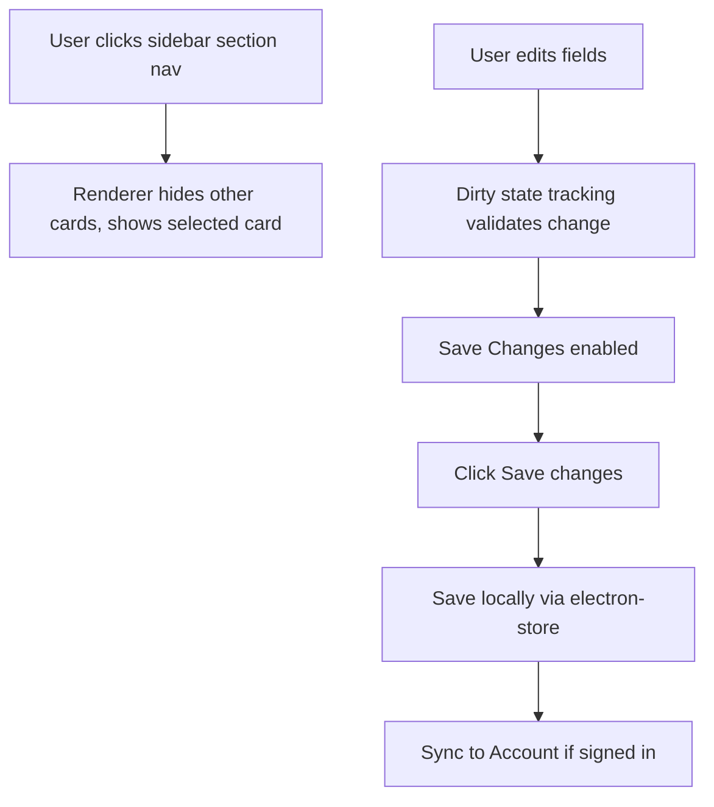

# Settings Window Redesign

## Goal
Refine, polish, and simplify the Koe settings window interface. The current settings interface is cramped, combines scroll-to-section navigation that can be buggy, has redundant top headers, and bloats the HTML with inline styles. We will rework it to:
1. Move all inline styles from `settings-window.html` into `settings.css` for a clean, production-grade codebase.
2. Replace the scroll-linked section navigation with a true, robust side-navigation tabbed layout within the Settings tab. Selecting a sidebar category will display only the relevant settings group, eliminating scrolling jumpiness and container height limitations.
3. Clean up and unify the "Account" status and credentials layout, integrating the status card directly into the Account settings panel.
4. Simplify and polish visual components, typography, hover transitions, and spacing using existing theme tokens for a premium, calm, and distinctive appearance.
5. Clarify immediate action buttons (Sign In, Sync BYOK) vs. local settings requiring the global "Save changes" action.

## Components

### Main Process (Server-side/Electron context)
* `src/main/settings-window.js`: Manages the Electron window lifecycle (resizable, show/hide, tabs).

### Renderer Process (Client-side/UI)
* `src/renderer/settings-window.html`: Clean HTML structure with tabs (Settings, History, Usage).
* `src/renderer/settings-window.js`: Class coordinates sub-panels and handles the sidebar menu tab switching.
* `src/renderer/components/settings-panel.js`: Handles settings load, dirty tracking, saving, testing API keys, and account sync actions.
* `src/renderer/styles/settings.css`: Unified styling sheet for all settings tab layouts and custom control details.

## Data Flow


## Database Schema (Settings Configuration)
No database schema changes are required. The existing settings object schema in `electron-store` is maintained:
```typescript
Settings {
  groqApiKey: string;
  language: string;
  enhanceText: boolean;
  promptStyle: string;
  customPrompt: string;
  autoPaste: boolean;
  launchOnStartup: boolean;
  autoUpdate: boolean;
  model: string;
  theme: "dark" | "light" | "system";
  hotkey: string;
}
```
