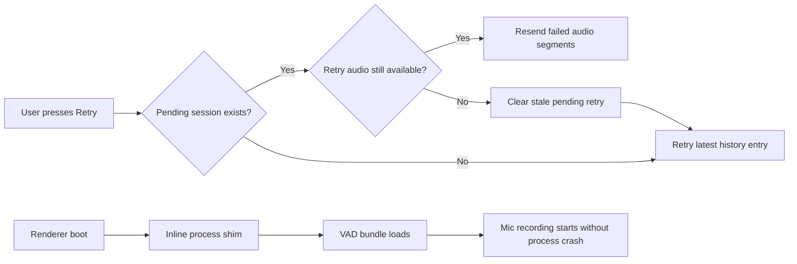

# Transcription Recovery Stability

## Goal
- Prevent retry shortcuts from getting stuck on missing temp audio.
- Keep Electron renderer startup stable when VAD dependencies expect a browser `process` global.
- Make failed transcription recovery degrade to the last saved transcript instead of repeatedly throwing.

## Components

### Client
- `src/renderer/index.html`
  - Defines a minimal browser-safe `process` shim before the module bundle loads.
- `src/renderer/settings-window.html`
  - Applies the same shim for the settings renderer so shared browser dependencies do not crash.

### Server / Main Process
- `src/main/services/transcription-session-manager.js`
  - Detects stale retry sessions whose failed segments no longer have retrievable audio.
  - Aborts stale pending retries instead of throwing `Retry audio for segment 0 is missing.`
- `src/main/services/retry-transcript.js`
  - Falls back to the latest history entry when the pending retry session is no longer recoverable.

## Data Flow

## Database Schema
- No schema changes.

## Regression Checks
- Pressing the retry shortcut should no longer loop on a stale pending retry with missing audio.
- If retry audio is unavailable, Koe should fall back to the latest transcript history entry instead of throwing.
- The renderer should be able to start recording without a `process is not defined` crash.
- Settings window startup should remain unaffected by the renderer shim.

## Notes
- This fix does not change the transcription model or enhancement model.
- It only hardens recovery behavior when the audio cache is gone or the browser runtime lacks Node globals.
