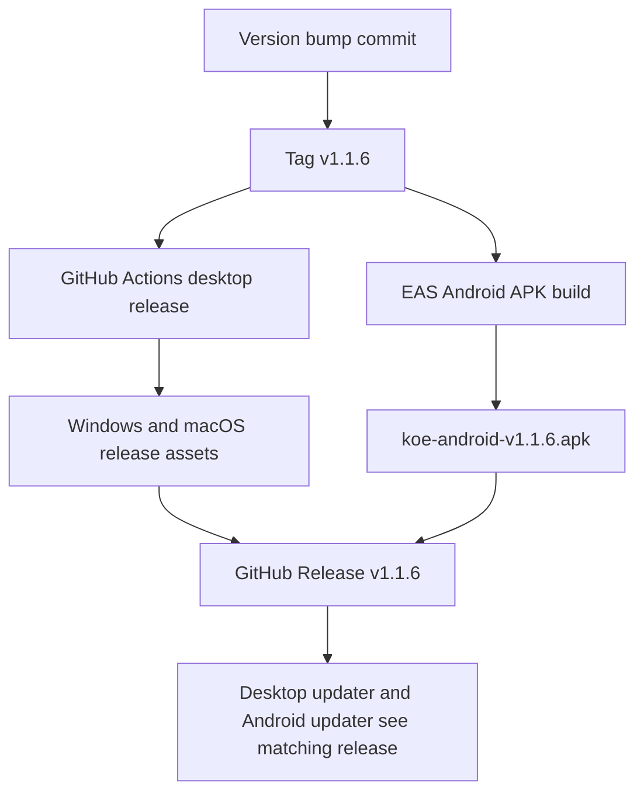

# Unified Desktop and Mobile Release

## Goal

Ship a new Koe release where the desktop app and Android mobile app use the same semantic version.

Target release:

- Desktop package version: `1.1.6`
- Mobile package version: `1.1.6`
- Expo app version: `1.1.6`
- GitHub release tag: `v1.1.6`

This release follows `docs/release-process.md`, which requires the desktop release tag to match the root `package.json` version exactly and recommends keeping the mobile package and Expo versions aligned.

## Components

### Client

- Root desktop app package metadata in `package.json`.
- Android mobile app package metadata in `apps/mobile/package.json`.
- Expo app metadata in `apps/mobile/app.json`.

### Server / Tooling

- GitHub Actions desktop release workflow at `.github/workflows/build-release.yml`.
- EAS Android APK release profile from `apps/mobile`.
- GitHub Release asset upload for the Android APK after EAS finishes.

## Data Flow

## Database Schema

No database schema changes.

This is a release/versioning task only.

## Implementation Plan

1. [x] Align desktop and mobile versions to `1.1.6`.
2. [x] Increase Android `versionCode` from `14` to `15` as the local fallback build number.
3. [x] Run release verification checks from `docs/release-process.md`.
4. [x] Commit the version and documentation changes.
5. [ ] Push the branch and create/push tag `v1.1.6`.
6. [ ] Trigger the EAS Android APK build from `apps/mobile`.
7. [ ] Download the finished APK and attach it to GitHub Release `v1.1.6` as `koe-android-v1.1.6.apk`.
8. [ ] Confirm the GitHub Release contains both desktop workflow artifacts and the Android APK, or report any external blocker.

## Regression Checks

- Root `package.json` version equals `1.1.6`.
- `apps/mobile/package.json` version equals `1.1.6`.
- `apps/mobile/app.json` `expo.version` equals `1.1.6`.
- `apps/mobile/app.json` `expo.android.versionCode` is greater than the previous value.
- Desktop release tag is exactly `v1.1.6`.
- Android APK asset is attached to the same release tag so Android and desktop updaters share a release number.

## Approval Gate

Approved by the user request to make a new release and keep mobile and PC versions the same number.
