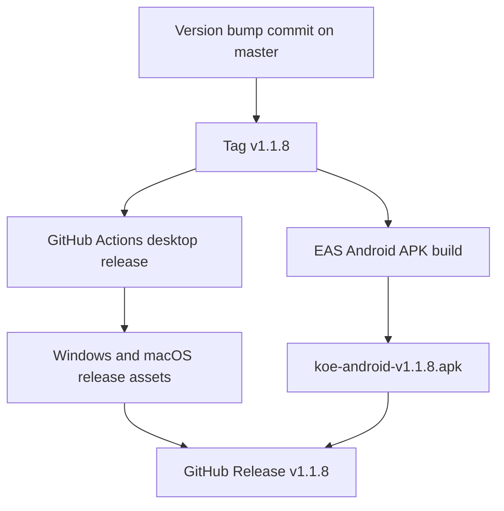

# Unified Desktop and Mobile Release 1.1.8

## Goal

Ship Koe `1.1.8` across all release tracks from the current `master` commit.

Target release:

- Desktop package version: `1.1.8`
- Mobile package version: `1.1.8`
- Expo app version: `1.1.8`
- Android fallback version code: `17`
- GitHub release tag: `v1.1.8`

This release follows `docs/release-process.md`. Desktop artifacts are produced by GitHub Actions from the tag, and the Android APK is produced by EAS from committed git state and attached to the matching GitHub Release.

## Components

### Client

- Root desktop metadata in `package.json`.
- Mobile package metadata in `apps/mobile/package.json`.
- Expo metadata in `apps/mobile/app.json`.

### Server / Tooling

- GitHub Actions desktop release workflow at `.github/workflows/build-release.yml`.
- EAS Android APK build profile `release-apk`.
- GitHub Release asset upload for `koe-android-v1.1.8.apk`.

## Data Flow

## Database Schema

No database schema changes.

## Implementation Plan

1. [x] Align desktop and mobile versions to `1.1.8`.
2. [x] Increase Android fallback `versionCode` from `16` to `17`.
3. [x] Run release verification checks from `docs/release-process.md`.
4. [ ] Commit and push the version/documentation changes.
5. [ ] Create and push tag `v1.1.8`.
6. [ ] Wait for GitHub Actions desktop release artifacts.
7. [ ] Trigger the EAS Android APK build from `apps/mobile`.
8. [ ] Download the finished APK and attach it to GitHub Release `v1.1.8`.
9. [ ] Confirm the release contains desktop artifacts and Android APK.

## Regression Checks

- Root `package.json` version equals `1.1.8`.
- `apps/mobile/package.json` version equals `1.1.8`.
- `apps/mobile/app.json` `expo.version` equals `1.1.8`.
- `apps/mobile/app.json` `expo.android.versionCode` is greater than the previous fallback value.
- Desktop release tag is exactly `v1.1.8`.
- Android APK asset is attached to the same release tag so Android and desktop updaters share a release number.

## Verification Results

- `pnpm type-check`: passed.
- `pnpm --filter koe-mobile exec expo config --type public`: passed and resolved Expo `version` `1.1.8` with Android `versionCode` `17`.
- `pnpm build:core`: passed.
- `pnpm build:website`: passed.
- `pnpm build:ci`: passed and produced a verified Windows desktop package locally for smoke testing.

## Approval Gate

Approved by the user request to release all versions of the app now.
