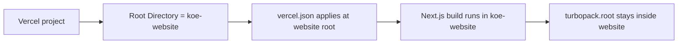

# Vercel Website Deployment Target

## Goal
- Make the deployable Next.js app explicit so Vercel builds `koe-website/` instead of the Electron monorepo root.
- Remove lockfile-root ambiguity for the website's Next.js build.

## Components

### Client
- `koe-website/next.config.ts`
  - Pins Turbopack's root to the website directory so Next.js stops inferring the monorepo root lockfile during builds.

### Server / Tooling
- `koe-website/vercel.json`
  - Declares the website project as a Next.js app when `koe-website/` is used as the Vercel project root.
- `README.md`
  - Documents the required Vercel Root Directory setting for this monorepo layout.

## Data Flow

## Database Schema
- No schema changes.

## Regression Checks
- `pnpm --dir koe-website build` must continue to succeed.
- Vercel deployment instructions must clearly point to `koe-website` as the project root.
