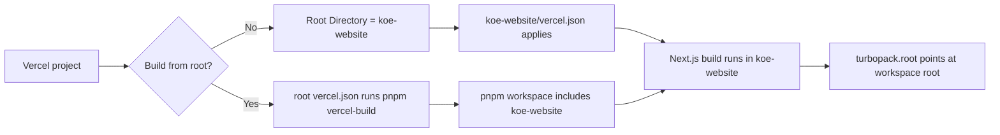

# Vercel Website Deployment Target

## Goal
- Make the deployable Next.js app explicit so Vercel builds `koe-website/` instead of the Electron monorepo root.
- Provide a repo-root Vercel fallback for cases where the project still evaluates the repository root.
- Remove lockfile-root ambiguity for the website's Next.js build.

## Components

### Client
- `koe-website/next.config.ts`
  - Pins Turbopack's root to the workspace root so the website can resolve hoisted Next.js dependencies during root-level builds.

### Server / Tooling
- `vercel.json`
  - Forces root-level Vercel builds to use the website's Next.js build command and output directory.
- `package.json`
  - Adds website-focused scripts plus a root-level `vercel-build` command and exposes Next.js at the repo root for framework detection.
- `pnpm-workspace.yaml`
  - Includes `koe-website` in the workspace so root installs include the website package.
- `koe-website/vercel.json`
  - Declares the website project as a Next.js app when `koe-website/` is used as the Vercel project root.
- `README.md`
  - Documents the required Vercel Root Directory setting for this monorepo layout.

## Data Flow

## Database Schema
- No schema changes.

## Regression Checks
- `pnpm --dir koe-website build` must continue to succeed.
- `pnpm vercel-build` must succeed from the repository root.
- Vercel deployment instructions must clearly point to `koe-website` as the project root.
