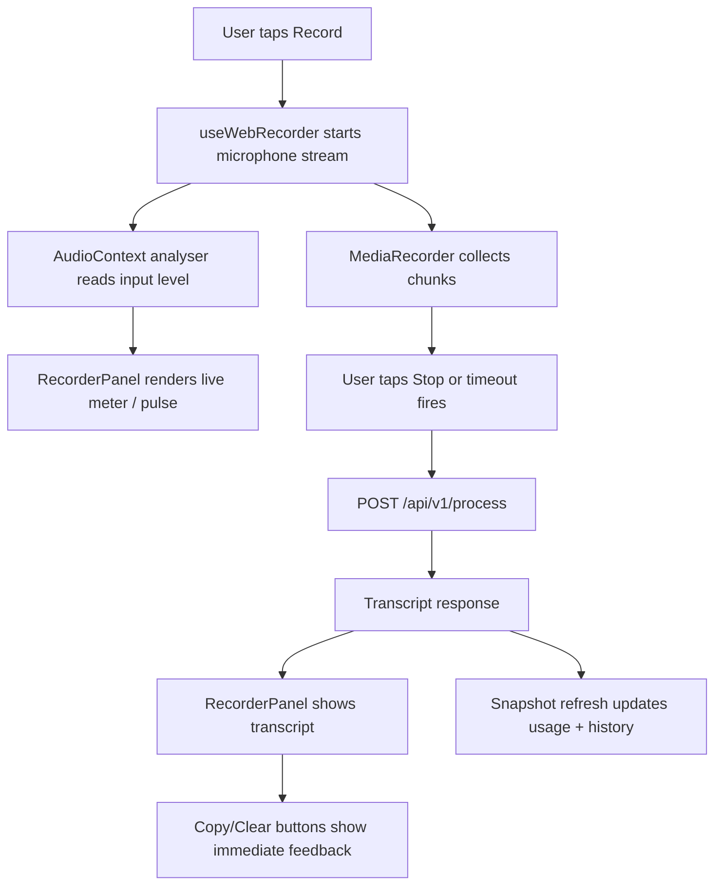

# Web App Recorder Feedback and Mobile Tabs

## Goal

Make the signed-in `/app` experience feel like a real recording tool instead of a static account page:

- show a clear live voice/input indicator while audio is entering the recorder
- make every action button visibly respond on desktop and mobile
- make copy/clear/history-copy actions confirm success or failure
- improve mobile priority so recording is first, with account, usage, and history available through app-style tabs instead of one long scroll

## Priority Order

1. **Recorder first**
   - The recorder/transcript surface should be the first signed-in view on mobile.
   - Desktop can keep the two-column layout, but the recorder should remain the dominant area.

2. **Voice activity / audio-level feedback**
   - Add a small meter, pulse, or level bars connected to the live microphone stream.
   - The indicator should show states for idle, listening, receiving sound, processing, and error.
   - It should not require server support; it should derive from browser audio input while recording.

3. **Button feedback**
   - All web-app actions should have hover, focus, active/pressed, disabled, and short success states.
   - Copy actions should visibly acknowledge "Copied" and gracefully report clipboard failure.
   - Mode buttons should show pressed/selected states clearly on touch screens.

4. **Mobile tabs**
   - Signed-in mobile layout should use tabs:
     - `Record`
     - `Account`
     - `History`
   - `Record` contains recorder, transcript, status, and primary actions.
   - `Account` contains signed-in identity, mode, and usage.
   - `History` contains recent account history and copy-entry actions.

## Components

### Client

Refactor the existing oversized `koe-website/components/web-app/WebKoeApp.tsx` into smaller files before adding more behavior:

- `WebKoeApp.tsx` ✅
  - top-level orchestration only
  - owns auth/session state and passes props down
- `types.ts` ✅
  - account, snapshot, auth, and app phase types
- `webAppUtils.ts` ✅
  - token storage, install id, formatting, API error helpers
- `hooks/useWebRecorder.ts` ✅
  - MediaRecorder setup
  - stream cleanup
  - recording timer
  - audio level analysis via Web Audio API
- `hooks/useCopyFeedback.ts` ✅
  - clipboard write handling
  - temporary main-copy and per-history-entry success labels
- `components/web-app/RecorderPanel.tsx` ✅
  - record button
  - live voice indicator
  - transcript panel
  - copy and clear actions
- `components/web-app/AccountPanel.tsx` ✅
  - identity
  - sign out
  - mode switch
  - usage summary
- `components/web-app/HistoryPanel.tsx` ✅
  - recent transcript list
  - copy-entry feedback
- `components/web-app/AuthPanel.tsx` ✅
  - signed-out sign-in/sign-up surface
- `components/web-app/StatusNotice.tsx` ✅
  - reusable account/recording status strip
- `components/web-app/WebAppTabs.tsx` ✅
  - mobile tab switcher
  - desktop layout bridge if useful

### Server

No new server endpoints are needed.

The existing endpoints remain:

- `GET /api/v1/account/snapshot`
- `PATCH /api/v1/account/mode`
- `POST /api/v1/process`
- `POST /api/v1/auth/signout`

## Data Flow

## Database Schema

No database schema changes.

This feature only changes client UI, client recorder state, and documentation. Transcript history and usage continue to use the existing `transcript_history`, `usage_events`, and `managed_usage_periods` tables.

## Interaction Details

### Voice Indicator

- Idle: quiet bordered meter with "Ready" state. ✅
- Recording: animated input bars driven by current audio level. ✅
- Receiving sound: amber highlight intensifies when input level rises. ✅
- Quiet while recording: noise-gated meter drops back to `Quiet` instead of staying on detected voice. ✅
- Visual treatment: removed the standalone speaker glyph and replaced it with waveform bars plus a subtle live signal pin. ✅
- Processing: spinner/progress styling replaces live bars. ✅
- Error: crimson border and short status text. ✅

### Button Feedback

- Use consistent button classes for brutalist action buttons and small utility buttons. ✅
- Add active translation so touch and mouse users see press feedback. ✅
- Add `focus-visible` outlines for keyboard access. ✅
- Disabled buttons look disabled; blocked states continue to update status text. ✅
- Copy sets temporary labels such as `COPIED` / `COPY FAILED`, then restores. ✅

### Mobile Layout

- For signed-in users, mobile does not show account cards before the recorder. ✅
- Mobile tabs are sticky directly below the system status bar after the page scrolls, without leaving a large distracting header gap. ✅
- The `Record` tab is default. ✅
- Desktop keeps account/sidebar plus recorder/history layout, with matching action feedback. ✅

## Regression Checks

- Public demo remains unchanged.
- Signed-in auth, snapshot loading, mode switching, process requests, and history refresh still work.
- Recording cleanup still stops tracks on unmount and after stop.
- Copy works for the main transcript and history entries.
- Clipboard failure does not crash the page.
- Mobile viewport does not horizontally scroll.
- Buttons do not resize unexpectedly when labels change to success text.
- No raw audio is stored by Koe.
- No raw provider keys or session tokens are logged.

## Testing Plan

- Run `pnpm type-check`.
- Run `pnpm lint`.
- Start the local Next dev server.
- Use browser verification at desktop and mobile widths:
  - sign-in state loads
  - recorder is first on mobile
  - tabs switch content
  - record button changes state
  - voice meter responds to microphone input when available
  - copy and copy-entry buttons show feedback
  - clear button clears transcript and responds visually

## Open Questions

- Should desktop also use tabs, or only mobile?
- Should the voice indicator be a compact level meter, a circular pulse around the record button, or both?
- Should history remain below the recorder on desktop, or move into a separate panel for a more app-like feel?
