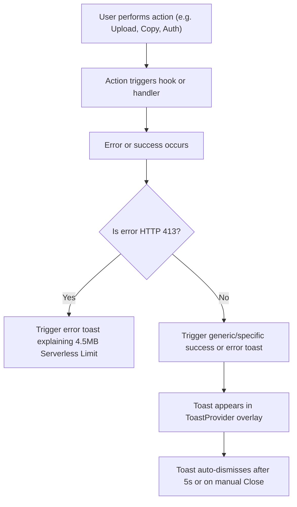

# Web App UI/UX and Toast Notifications

## Goal

Improve the visual feedback, error handling, readability, and mobile responsiveness of the browser web app in `app/`. Specifically, address the lack of error visibility for HTTP 413 (Content Too Large) errors and other processing exceptions, make these errors actionable and clear, and add premium, custom-styled toast notifications in the Terminal Noir/Brutalist theme.

## Proposed Components

### Client

1. **`Toast.tsx`** [NEW]
   - Renders a global toast notification context provider (`ToastProvider`) and a hook (`useToast`).
   - Renders a queue of interactive, custom brutalist toasts (success, error, warning, info) with offset shadow styling, fade/slide animation, and automatic dismiss timing.
   - Built to align perfectly with the "Terminal Noir" color scheme (`void`, `bone`, `amber`, `zinc`, `crimson`).

2. **`WebKoeApp.tsx`** [MODIFY]
   - Wrap with the `ToastProvider` to enable global toasts.
   - Connect error/success callbacks to toast triggers instead of solely updating the static status notice.
   - Intercept and handle HTTP 413 "Content Too Large" errors to show a descriptive warning about the web upload size limitation (4.5 MB on serverless platforms) vs. desktop/mobile native app capabilities.
   - Improve mobile layout tab switching: keep the tabs sticky, make font sizes larger for better readability, and improve layout padding on smaller screens.

3. **`AudioUploadPanel.tsx`** [MODIFY]
   - Adjust `MAX_AUDIO_BYTES` on the web to `4.5 * 1024 * 1024` (4.5 MB) so that users get an immediate frontend validation error if they select an audio file that exceeds the Vercel server limit, preventing needless upload wait times and obscure server errors.
   - Provide a clear message pointing users to use the desktop or mobile apps for larger files.
   - Add warning/error toasts on invalid files.

4. **`RecorderPanel.tsx`** [MODIFY]
   - Integrate toast notifications for microphone access errors or recorder failures.
   - Integrate toast notifications for recording success or copy success.
   - Improve layout spacing on smaller screens.

5. **`AccountPanel.tsx`** [MODIFY]
   - Update billing, verification, and mode actions to trigger success/error toasts.

6. **`HistoryPanel.tsx`** [MODIFY]
   - Update history copy actions to show toast notifications.

## Data Flow

## Database Schema

No database changes are required.

## Interaction & Visuals

- **Toast Style:** 
  - Thick brutalist border (`border-2`)
  - Accent colored offset shadow (`shadow-[4px_4px_0px_...]`)
  - Colors matching states:
    - Error: `border-crimson text-bone shadow-crimson/50`
    - Success: `border-amber text-bone shadow-amber/50`
    - Warning: `border-amber text-amber shadow-amber/30`
    - Info: `border-zinc text-bone shadow-zinc/30`
  - Positioned at the top-right of the viewport for desktop, and centered at the top for mobile devices.
- **File Validation:**
  - Front-end check rejects files > 4.5 MB and triggers a toast warning, linking the issue to the web environment constraint.
