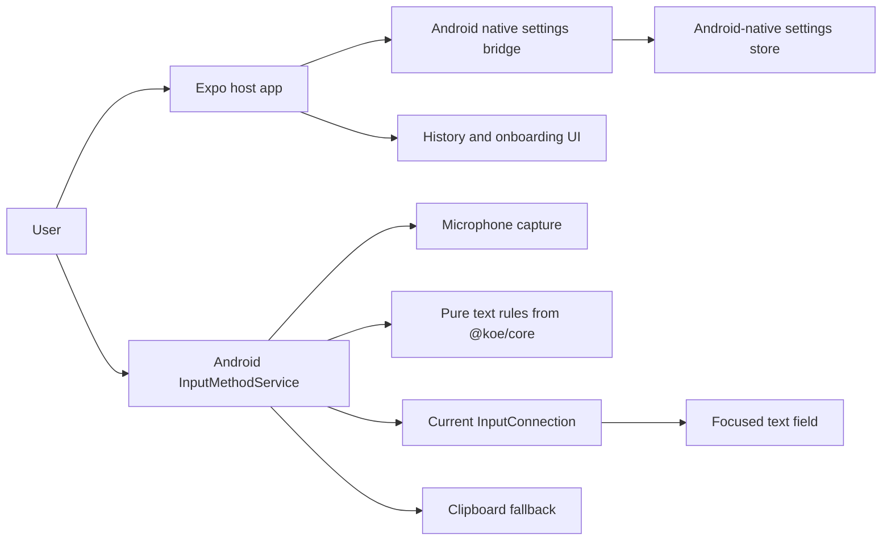

# Android IME Architecture And Native Boundary

**Session ID:** orch-20260319-android-ime-voice-keyboard  
**Task:** 01_android_ime_architecture_and_native_boundary  
**Status:** Architecture guardrail complete  
**Date:** 2026-03-19

## Purpose

This note defines the minimum shippable Android IME boundary for Koe Voice.
It intentionally keeps v1 narrow so we do not drift into a full keyboard product.

## Open Technical Unknowns

These are the questions to resolve before implementation work starts:

1. Should the Android-native settings store be `EncryptedSharedPreferences` or `DataStore` with encryption?
2. Should the host Expo app keep SecureStore as a legacy mirror, or migrate fully to the native store?
3. Which small pure helpers from `@koe/core` should be duplicated in Kotlin versus bridged later?
4. How should optional retry state be persisted between IME launches?
5. Which secure or restricted fields should always fall back to clipboard instead of direct insertion?

## Discovery Summary

- `apps/mobile/app.json` already enables `expo-secure-store` and `expo-audio`.
- `apps/mobile/src/hooks/use-recording-pipeline.ts` currently owns microphone capture, retry state, transcription orchestration, and final clipboard copy from React Native UI.
- `apps/mobile/src/storage/secure-storage.ts` and `apps/mobile/src/storage/settings-storage.ts` both persist app data through Expo SecureStore.
- `packages/koe-core` already contains shared prompt, session, text, and settings helpers, but it is TypeScript and not a native IME runtime.
- The repo does not yet contain a checked-in Android native project.

## Recommended Architecture

### Host Expo App

The host app stays the control center for:

- onboarding
- API key entry and settings editing
- history
- enablement guidance for the Android keyboard
- writing IME-readable settings into the native storage bridge

The host app should not own the live dictation loop in v1.

### Android IME Service

The IME owns the user-facing keyboard surface and the full dictation lifecycle:

- `InputMethodService` lifecycle
- minimal voice-first view with record, stop, and cancel actions
- microphone capture inside the IME process
- direct insertion into the focused field through `InputConnection.commitText`
- clipboard fallback when direct insertion fails or is rejected
- optional voice subtype metadata so Android can recognize the input mode

The IME should not implement a full QWERTY keyboard in v1.

### Shared Logic Boundary

Keep `@koe/core` as the canonical home for pure, reusable logic:

- default prompt content
- transcript cleanup and normalization
- settings types and schema shape
- output shaping helpers
- session and usage primitives that do not depend on React or Expo

Do not make the IME depend on Expo SecureStore, React hooks, or any RN UI code.
If the native side needs a helper from `@koe/core`, either mirror the small pure rule in Kotlin or bridge it later through a dedicated native layer.

### Transcription And Refinement Placement

Recommended placement for v1:

- audio capture stays native inside the IME
- transcription request orchestration stays native inside the IME or a thin native helper
- prompt shaping and transcript cleanup stay in the shared pure logic layer
- the host app only edits configuration and never manages the active dictation session

This keeps the IME functional without any React Native UI dependency during dictation.

## Native Storage Contract

The IME and the host app should read and write the same Android-native settings boundary.
That boundary should expose at least:

- `groqApiKey`
- `language`
- `model`
- `promptStyle`
- `customPrompt`
- `enhanceText`
- optional `lastResult` or retry state for recovery

`autoPaste` can remain a host-app clipboard preference if needed, but it should not drive the IME v1 path.

Recommended implementation shape:

- one native settings abstraction owned by Android
- one bridge for the Expo host app to read/write it
- one reader for the IME service

This avoids relying on direct Expo SecureStore access from the IME.

## Lifecycle Assumptions

- Dictation is explicit and user initiated while the keyboard is visible.
- No background ambient listening.
- The IME may be recreated by the OS, so session state must survive service lifecycle interruptions until stop or cancel.
- Final text is inserted only after transcription and optional refinement complete.
- If a target field refuses direct insertion, the IME falls back to clipboard and surfaces that clearly.
- `onStartInput` and `onFinishInput` should reset transient UI/session state for the current field.

## v1 Scope Lock

Voice-input IME only:

- Android only
- voice-first control surface
- no full keyboard replacement
- no Samsung Keyboard or Gboard integration
- no live partial insertion
- no Quick Settings tile
- no widget entry point
- no iOS keyboard parity
- no ambient listening
- no speaker adaptation or personalization

## Platform Boundary

## Android API Notes

The Android IME should be built around the platform primitives documented by Android:

- an app containing an `InputMethodService`
- manifest registration with `BIND_INPUT_METHOD`, `android.view.InputMethod`, and IME metadata
- `InputConnection` for committing final text into the focused field
- `onCreateInputView`, `onStartInput`, and `onFinishInput` for UI and lifecycle handling

## Development Workflow Note

Because the repo does not yet contain a checked-in Android native project, Task 02 should assume a
development-build workflow with generated native Android files rather than Expo Go. The IME cannot be
implemented or verified inside the standard Expo Go runtime.

## Implementation Handoff

This task is complete when the next implementation tasks can follow these rules without re-deciding scope.

Recommended next steps:

1. Bootstrap the Android native project and register the IME service.
2. Build the minimal voice-first IME surface and prove `commitText`.
3. Add native audio capture and session state.
4. Wire transcription, refinement, and clipboard fallback.
5. Bridge the host app settings into the native store.

## Acceptance Check

- [x] Concrete architecture note exists for app, IME, and shared logic boundaries
- [x] Shared storage strategy is defined and does not rely on direct Expo SecureStore access from the IME
- [x] V1 scope is explicitly limited to a voice-input IME
- [x] Open technical unknowns are listed before implementation starts

## References

- [Android Developers: Create an input method](https://developer.android.com/develop/ui/views/touch-and-input/creating-input-method)
- [Android Developers: InputMethodService](https://developer.android.com/reference/android/inputmethodservice/InputMethodService)
- [Android Developers: InputConnection](https://developer.android.com/reference/android/view/inputmethod/InputConnection)
- [Expo SecureStore docs](https://docs.expo.dev/versions/latest/sdk/securestore/)
